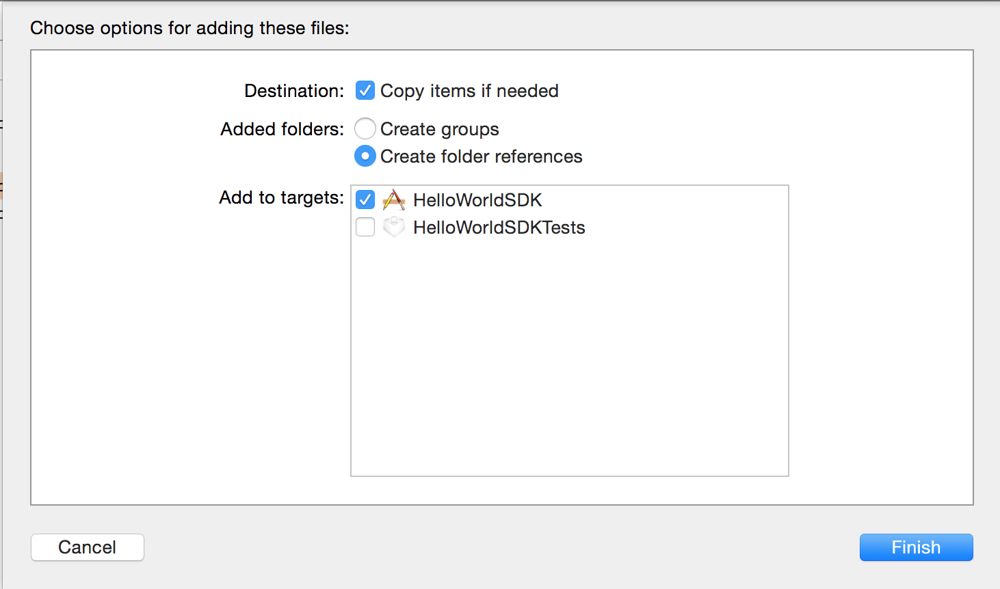
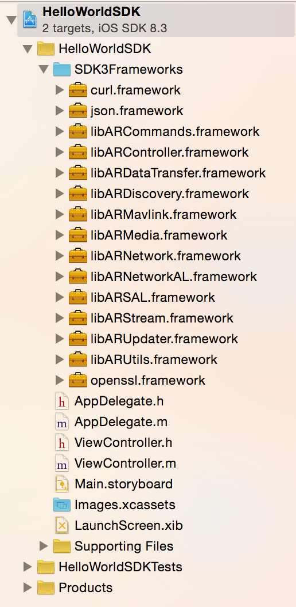
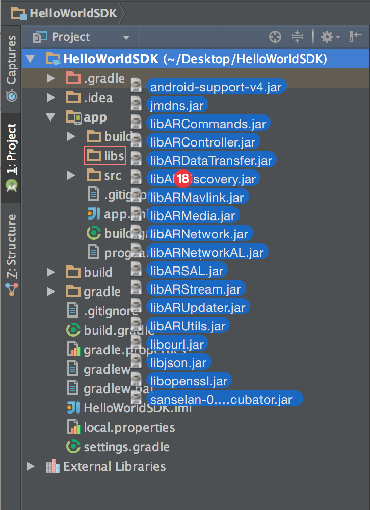
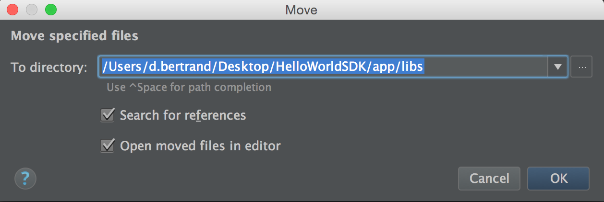

#How to use

## Creating a project

To use the sdk, you will need to add the libraries to your project. To get the libraries, you can either download the released ones, or build your own with the sources (see [how to build the SDK](#how-to-build-the-sdk)).

### iOS

1. First, download the binaries : [SDK version 3.5 frameworks](https://github.com/Parrot-Developers/ARSDKBuildUtils/releases/download/ARSDK3_version_3_5/ARSDK3_iOS_3_5.zip)
2. Unzip it and rename it (for example rename it SDK3Frameworks).
3. Drag and drop the folder into your project

4. Click on finish

5. You're all set ! 


You can now start reading the documentation for the product you want to control : 

* [Bebop Drone](#bebop-drone)
* [Jumping Sumo](#jumping-sumo)
* [Rolling Spider](#rolling-spider)

### Android

1. First, download the binaries : [SDK version 3.5 jars](https://github.com/Parrot-Developers/ARSDKBuildUtils/releases/download/ARSDK3_version_3_5/ARSDK3_Android_3_5.zip)
2. Unzip it.
3. Drag and drop the jars to your project libs folder. (Watch out, this will move the jars into your project).
   
4. Accept to move files
   
5. Accept the access to non-project files
   
6. Add permissions in your manifest file

> Add permissions in your manifest file

```java
    <uses-permission android:name="android.permission.INTERNET" />
    <uses-permission android:name="android.permission.BLUETOOTH"/>
    <uses-permission android:name="android.permission.BLUETOOTH_ADMIN"/>
    <uses-permission android:name="android.permission.ACCESS_NETWORK_STATE" />
    <uses-permission android:name="android.permission.ACCESS_WIFI_STATE" />
    <uses-permission android:name="android.permission.CHANGE_WIFI_MULTICAST_STATE"/>
    <uses-permission android:name="android.permission.WRITE_EXTERNAL_STORAGE" />
```

7.. And finally load the native libraries in your Application or in the main activity (and every other activity that can be launched by an external intent).

> load the native libraries

```java
static
{
   try
   {
       System.loadLibrary("arsal");
       System.loadLibrary("arsal_android");
       System.loadLibrary("arnetworkal");
       System.loadLibrary("arnetworkal_android");
       System.loadLibrary("arnetwork");
       System.loadLibrary("arnetwork_android");
       System.loadLibrary("arcommands");
       System.loadLibrary("arcommands_android");
       System.loadLibrary("ardiscovery");
       System.loadLibrary("ardiscovery_android");
   }
   catch (Exception e)
   {
       Log.e(TAG, "Problem occured during native library loading", e);
   }
}
```
You can now start reading the documentation for the product you want to control : 

* [Bebop Drone](#bebop-drone)

<!---
* [Jumping Sumo](#jumping-sumo)
* [Rolling Spider](#rolling-spider)
-->

##Bebop Drone

Here are the instruction about how to use the SDK to control the Bebop drone.

### Discover the drones
First of all, you will need to discover the drones around you. To do that, we will use the libARDiscovery.

> Start discovery:

```objective_c
- (void)startDiscovery
{
    [[ARDiscovery sharedInstance] start];
}
```

```java
private ARDiscoveryService mArdiscoveryService;
private ServiceConnection mArdiscoveryServiceConnection;

private void initDiscoveryService()
{
   // create the service connection
   if (mArdiscoveryServiceConnection == null)
   {
       mArdiscoveryServiceConnection = new ServiceConnection()
       {
           @Override
           public void onServiceConnected(ComponentName name, IBinder service)
           {
               mArdiscoveryService = ((ARDiscoveryService.LocalBinder) service).getService();

               startDiscovery();
           }

           @Override
           public void onServiceDisconnected(ComponentName name)
           {
               mArdiscoveryService = null;
           }
       };
   }

   if (mArdiscoveryService == null)
   {
       // if the discovery service doesn't exists, bind to it
       Intent i = new Intent(getApplicationContext(), ARDiscoveryService.class);
       getApplicationContext().bindService(i, mArdiscoveryServiceConnection, Context.BIND_AUTO_CREATE);
   }
   else
   {
       // if the discovery service already exists, start discovery
       startDiscovery();
   }
}

private void startDiscovery()
{
   if (mArdiscoveryService != null)
   {
       mArdiscoveryService.start();
   }
}
```

> The libARDiscovery will let you know when BLE and Wifi devices have been found on network:

```objective_c
- (void)registerReceivers
{
    [[NSNotificationCenter defaultCenter] addObserver:self selector:@selector(discoveryDidUpdateServices:) name:kARDiscoveryNotificationServicesDevicesListUpdated object:nil];
}

- (void)discoveryDidUpdateServices:(NSNotification *)notification
{
    NSArray *deviceList = [[notification userInfo] objectForKey:kARDiscoveryServicesList];
    
    // Do what you want with the device list (deviceList is an array of ARService*)
}
```

```java
// your class should implement ARDiscoveryServicesDevicesListUpdatedReceiverDelegate
private void registerReceivers()
{
    mArdiscoveryServicesDevicesListUpdatedReceiver = new ARDiscoveryServicesDevicesListUpdatedReceiver(this);
    LocalBroadcastManager localBroadcastMgr = LocalBroadcastManager.getInstance(getApplicationContext());
   localBroadcastMgr.registerReceiver(mArdiscoveryServicesDevicesListUpdatedReceiver, new IntentFilter(ARDiscoveryService.kARDiscoveryServiceNotificationServicesDevicesListUpdated));
}

@Override
public void onServicesDevicesListUpdated()
{
    Log.d(TAG, "onServicesDevicesListUpdated ...");

    if (mArdiscoveryService != null)
    {
        List<ARDiscoveryDeviceService> deviceList = mArdiscoveryService.getDeviceServicesArray();

        // Do what you want with the device list
    }
}
```

> Once you have the ARService you want to use, transform it into an ARDiscoveryDevice (you will need it at the [next step](#create_device_controller)) 

```objective_c
// this should be called in background
- (ARDISCOVERY_Device_t *)createDiscoveryDeviceWithService:(ARService*)service
{
    ARDISCOVERY_Device_t *device = NULL;
    
    eARDISCOVERY_ERROR errorDiscovery = ARDISCOVERY_OK;
    
    device = ARDISCOVERY_Device_New (&errorDiscovery);
    
    if (errorDiscovery == ARDISCOVERY_OK)
    {
        // init the discovery device
        if (service.product == ARDISCOVERY_PRODUCT_ARDRONE)
        {
            // need to resolve service to get the IP
            BOOL resolveSucceeded = [self resolveService:service];
            
            if (resolveSucceeded)
            {
                NSString *ip = [[ARDiscovery sharedInstance] convertNSNetServiceToIp:service];
                int port = (int)[(NSNetService *)service.service port];
                
                if (ip)
                {
                    // create a Wifi discovery device
                    errorDiscovery = ARDISCOVERY_Device_InitWifi (device, service.product, [service.name UTF8String], [ip UTF8String], port);
                }
                else
                {
                    NSLog(@"ip is null");
                    errorDiscovery = ARDISCOVERY_ERROR;
                }
            }
            else
            {
                NSLog(@"Resolve error");
                errorDiscovery = ARDISCOVERY_ERROR;
            }
        }
        
        if (errorDiscovery != ARDISCOVERY_OK)
        {
            ARDISCOVERY_Device_Delete(&device);
        }
    }
    
    return device;
}

#pragma mark resolveService
- (BOOL)resolveService:(ARService*)service
{
    BOOL retval = NO;
    _resolveSemaphore = dispatch_semaphore_create(0);
    [[NSNotificationCenter defaultCenter] addObserver:self selector:@selector(discoveryDidResolve:) name:kARDiscoveryNotificationServiceResolved object:nil];
    [[NSNotificationCenter defaultCenter] addObserver:self selector:@selector(discoveryDidNotResolve:) name:kARDiscoveryNotificationServiceNotResolved object:nil];
    
    [[ARDiscovery sharedInstance] resolveService:service];
    
    // this semaphore will be signaled in discoveryDidResolve and discoveryDidNotResolve
    dispatch_semaphore_wait(_resolveSemaphore, dispatch_time(DISPATCH_TIME_NOW, 10000000000));
    
    NSString *ip = [[ARDiscovery sharedInstance] convertNSNetServiceToIp:service];
    if (ip != nil)
    {
        retval = YES;
    }
    
    [[NSNotificationCenter defaultCenter] removeObserver:self name:kARDiscoveryNotificationServiceResolved object:nil];
    [[NSNotificationCenter defaultCenter] removeObserver:self name:kARDiscoveryNotificationServiceNotResolved object:nil];
    _resolveSemaphore = nil;
    return retval;
}

- (void)discoveryDidResolve:(NSNotification *)notification
{
    dispatch_semaphore_signal(_resolveSemaphore);
}

- (void)discoveryDidNotResolve:(NSNotification *)notification
{
    NSLog(@"Resolve failed");
    dispatch_semaphore_signal(_resolveSemaphore);
}
```

```java
    private ARDiscoveryDevice createDiscoveryDevice(ARDiscoveryDeviceService service)
    {
        ARDiscoveryDevice device = null;
        if ((service != null) && 
                (ARDISCOVERY_PRODUCT_ENUM.ARDISCOVERY_PRODUCT_ARDRONE.equals(ARDiscoveryService.getProductFromProductID(service.getProductID()))))
        {
            try
            {
                device = new ARDiscoveryDevice();

                ARDiscoveryDeviceNetService netDeviceService = (ARDiscoveryDeviceNetService) service.getDevice();

                device.initWifi(ARDISCOVERY_PRODUCT_ENUM.ARDISCOVERY_PRODUCT_ARDRONE, netDeviceService.getName(), netDeviceService.getIp(), netDeviceService.getPort());
            }
            catch (ARDiscoveryException e)
            {
                e.printStackTrace();
                Log.e(TAG, "Error: " + e.getError());
            }
        }

        return device;
    }
```

> Clean everything:

```objective_c
- (void)unregisterReceivers
{
    [[NSNotificationCenter defaultCenter] removeObserver:self name:kARDiscoveryNotificationServicesDevicesListUpdated object:nil];
}

- (void)stopDiscovery
{
    [[ARDiscovery sharedInstance] stop];
}
```

```java
private void unregisterReceivers()
{
    LocalBroadcastManager localBroadcastMgr = LocalBroadcastManager.getInstance(getApplicationContext());

    localBroadcastMgr.unregisterReceiver(mArdiscoveryServicesDevicesListUpdatedReceiver);
}

private void closeServices()
{
    Log.d(TAG, "closeServices ...");

    if (mArdiscoveryService != null)
    {
        new Thread(new Runnable() {
            @Override
            public void run()
            {
                mArdiscoveryService.stop();

                getApplicationContext().unbindService(mArdiscoveryServiceConnection);
                mArdiscoveryService = null;
            }
        }).start();
    }
}
```

### <a name="create_device_controller">Setup a device controller</a>
The device controller is an object that will make the interface between the drone and you. 

**After having [started](#start_device_controller) the device controller, you should receive all its states and settings through the command received callback.**

> Create the device controller:

```objective_c
eARCONTROLLER_ERROR error = ARCONTROLLER_OK;
ARCONTROLLER_Device_t *deviceController = ARCONTROLLER_Device_New (discoveryDevice, &error);
```

```java
try
{
    deviceController = new ARDeviceController (device);
}
catch (ARControllerException e)
{
    e.printStackTrace();
}
```

> Listen to the states changes:

```objective_c
error = ARCONTROLLER_Device_AddStateChangedCallback(deviceController, stateChanged, (__bridge void *)(self));

// called when the state of the device controller has changed
void stateChanged (eARCONTROLLER_DEVICE_STATE newState, eARCONTROLLER_ERROR error, void *customData)
{
    // SELF_TYPE is the class name of self
    SELF_TYPE *selfCpy = (__bridge SELF_TYPE *)customData;
    
    switch (newState)
    {
        case ARCONTROLLER_DEVICE_STATE_RUNNING:
            break;
        case ARCONTROLLER_DEVICE_STATE_STOPPED:
            break;
        case ARCONTROLLER_DEVICE_STATE_STARTING:
            break;
        case ARCONTROLLER_DEVICE_STATE_STOPPING:
            break;
        default:
            break;
    }
}
```

```java
// your class should implement ARDeviceControllerListener
deviceController.addListener (this);

@Override
// called when the state of the device controller has changed
public void onStateChanged (ARDeviceController deviceController, ARCONTROLLER_DEVICE_STATE_ENUM newState, ARCONTROLLER_ERROR_ENUM error)
{
    switch (newState)
    {
        case ARCONTROLLER_DEVICE_STATE_RUNNING:
            break;
        case ARCONTROLLER_DEVICE_STATE_STOPPED:
            break;
        case ARCONTROLLER_DEVICE_STATE_STARTING:
            break;
        case ARCONTROLLER_DEVICE_STATE_STOPPING:
            break;

        default:
            break;
    }
}
```

> <a name="add_commands_receive_cb">Listen to the commands received from the drone (example of the battery level received)</a>

```objective_c
error = ARCONTROLLER_Device_AddCommandReceivedCallback(deviceController, onCommandReceived, (__bridge void *)(self));

// called when a command has been received from the drone
void onCommandReceived (eARCONTROLLER_DICTIONARY_KEY commandKey, ARCONTROLLER_DICTIONARY_ELEMENT_t *elementDictionary, void *customData)
{
    SELF_TYPE *selfCpy = (__bridge SELF_TYPE *)customData;
    
    if (elementDictionary != NULL)
    {
        // if the command received is a battery state changed
        if (commandKey == ARCONTROLLER_DICTIONARY_KEY_COMMON_COMMONSTATE_BATTERYSTATECHANGED)
        {
            ARCONTROLLER_DICTIONARY_ARG_t *arg = NULL;
            ARCONTROLLER_DICTIONARY_ELEMENT_t *element = NULL;
            
            // get the command received in the device controller
            HASH_FIND_STR (elementDictionary, ARCONTROLLER_DICTIONARY_SINGLE_KEY, element);
            if (element != NULL)
            {
                // get the value
                HASH_FIND_STR (element->arguments, ARCONTROLLER_DICTIONARY_KEY_COMMON_COMMONSTATE_BATTERYSTATECHANGED_PERCENT, arg);
                
                if (arg != NULL)
                {
                    uint8_t batteryLevel = arg->value.U8;
                    // do what you want with the battery level
                }
            }
        }
        // else if (commandKey == THE COMMAND YOU ARE INTERESTED IN)
    }
}
```

```java
// your class should implement ARDeviceControllerListener
deviceController.addListener (this);

@Override
// called when a command has been received from the drone
public void onCommandReceived(ARDeviceController deviceController, ARCONTROLLER_DICTIONARY_KEY_ENUM commandKey, ARControllerDictionary elementDictionary)
{
    if (elementDictionary != null)
    {
        // if the command received is a battery state changed
        if (commandKey == ARCONTROLLER_DICTIONARY_KEY_ENUM.ARCONTROLLER_DICTIONARY_KEY_COMMON_COMMONSTATE_BATTERYSTATECHANGED)
        {
            ARControllerArgumentDictionary<Object> args = elementDictionary.get(ARControllerDictionary.ARCONTROLLER_DICTIONARY_SINGLE_KEY);

            if (args != null)
            {
                Integer batValue = (Integer) args.get(ARFeatureCommon.ARCONTROLLER_DICTIONARY_KEY_COMMON_COMMONSTATE_BATTERYSTATECHANGED_PERCENT);

                // do what you want with the battery level
            }
        }
    }
    else
    {
        Log.e(TAG, "elementDictionary is null");
    }
}
```

> <a name="bebop_add_video_receive_cb">Listen to the video stream received from the drone

```objective_c
error = ARCONTROLLER_Device_SetVideoReceiveCallback (deviceController, didReceiveFrameCallback, NULL , void *customData);

void didReceiveFrameCallback (ARCONTROLLER_Frame_t *frame, void *customData)
{
    // display the frame
}
```

```java
// your class should implement ARDeviceControllerStreamListener
deviceController.addStreamListener(this);

@Override
public void onFrameReceived(ARDeviceController deviceController, ARFrame frame)
{
    // display the frame
}

@Override
public void onFrameTimeout(ARDeviceController deviceController)
{
}
```

> <a name="start_device_controller">Finally, starts the device controller (after that call, the callback you set in ARCONTROLLER_Device_AddStateChangedCallback should be called)</a>.

```objective_c
error = ARCONTROLLER_Device_Start (deviceController);
if (error == ARCONTROLLER_OK)
{
    _deviceController = deviceController;
}
```

```java
ARCONTROLLER_ERROR_ENUM error = deviceController.start();
```

> Cleanup when done:

```objective_c
- (void)deleteDeviceController
{
    // in background
    dispatch_async(dispatch_get_global_queue(DISPATCH_QUEUE_PRIORITY_DEFAULT, 0), ^{
        eARCONTROLLER_ERROR error = ARCONTROLLER_OK;
        
        // if the device controller is not stopped, stop it
        eARCONTROLLER_DEVICE_STATE state = ARCONTROLLER_Device_GetState(_deviceController, &error);
        if ((error == ARCONTROLLER_OK) && (state != ARCONTROLLER_DEVICE_STATE_STOPPED))
        {
            // after that, stateChanged should be called soon
            error = ARCONTROLLER_Device_Stop (_deviceController);
            
            if (error == ARCONTROLLER_OK)
            {
                dispatch_semaphore_wait(_stateSem, DISPATCH_TIME_FOREVER);
            }
            else
            {
                NSLog(@"- error :%s", ARCONTROLLER_Error_ToString(error));
            }
        }
        
        // once the device controller is stopped, we can delete it
        if (_deviceController != NULL)
        {
            ARCONTROLLER_Device_Delete(&_deviceController);
        }
    });
}

// dont forget to add dispatch_semaphore_signal(pilotingViewController.stateSem); in the case ARCONTROLLER_DEVICE_STATE_STOPPED of the stateChanged function
```

```java
ARCONTROLLER_ERROR_ENUM error = deviceController.stop();
```

### Taking off
In order to make your drone take off you will need to ensure that its flying status is landed (even if you can send take off commands anyway, it just won't take of if it not in landed state). <br/>
Then, you can send the take off command. <br/>
In response, your drone will send you a state change (if it has taken off) : State *Landed* -> State *TakingOff* -> State *Hovering* (or *Flying*).

> Take off

```objective_c
- (eARCOMMANDS_ARDRONE3_PILOTINGSTATE_FLYINGSTATECHANGED_STATE)getFlyingState {
    
    eARCOMMANDS_ARDRONE3_PILOTINGSTATE_FLYINGSTATECHANGED_STATE flyingState = ARCOMMANDS_ARDRONE3_PILOTINGSTATE_FLYINGSTATECHANGED_STATE_MAX;
    
    eARCONTROLLER_ERROR error;
    // get the current flying state description
    ARCONTROLLER_DICTIONARY_ELEMENT_t *elementDictionary = ARCONTROLLER_ARDrone3_GetCommandElements(_deviceController->aRDrone3, ARCONTROLLER_DICTIONARY_KEY_ARDRONE3_PILOTINGSTATE_FLYINGSTATECHANGED, &error);
    if (!error && elementDictionary != NULL)
    {
        ARCONTROLLER_DICTIONARY_ARG_t *arg = NULL;
        ARCONTROLLER_DICTIONARY_ELEMENT_t *element = NULL;
        HASH_FIND_STR (elementDictionary, ARCONTROLLER_DICTIONARY_SINGLE_KEY, element);
        if (element != NULL)
        {
            // get the value
            HASH_FIND_STR (element->arguments, ARCONTROLLER_DICTIONARY_KEY_ARDRONE3_PILOTINGSTATE_FLYINGSTATECHANGED_STATE, arg);
            
            if (arg != NULL)
            {
                // Enums are I32
                flyingState = arg->value.I32;
            }
        }
    }
    
    return flyingState;
}

- (void)takeoff
{
    if ([self getFlyingState] == ARCOMMANDS_ARDRONE3_PILOTINGSTATE_FLYINGSTATECHANGED_STATE_LANDED)
    {
        _deviceController->aRDrone3->sendPilotingTakeOff(_deviceController->aRDrone3);
    }
}
```

```java
private ARCOMMANDS_ARDRONE3_PILOTINGSTATE_FLYINGSTATECHANGED_STATE_ENUM getPilotingState()
{
    ARCOMMANDS_ARDRONE3_PILOTINGSTATE_FLYINGSTATECHANGED_STATE_ENUM flyingState = ARCOMMANDS_ARDRONE3_PILOTINGSTATE_FLYINGSTATECHANGED_STATE_ENUM.eARCOMMANDS_ARDRONE3_PILOTINGSTATE_FLYINGSTATECHANGED_STATE_UNKNOWN_ENUM_VALUE;
    if (deviceController != null)
    {
        try
        {
            ARControllerDictionary dict = deviceController.getCommandElements(ARCONTROLLER_DICTIONARY_KEY_ENUM.ARCONTROLLER_DICTIONARY_KEY_ARDRONE3_PILOTINGSTATE_FLYINGSTATECHANGED);
            if (dict != null)
            {
                ARControllerArgumentDictionary<Object> args = dict.get(ARControllerDictionary.ARCONTROLLER_DICTIONARY_SINGLE_KEY);
                if (args != null)
                {
                    Integer flyingStateInt = (Integer) args.get(ARFeatureARDrone3.ARCONTROLLER_DICTIONARY_KEY_ARDRONE3_PILOTINGSTATE_FLYINGSTATECHANGED_STATE);
                    flyingState = ARCOMMANDS_ARDRONE3_PILOTINGSTATE_FLYINGSTATECHANGED_STATE_ENUM.getFromValue(flyingStateInt);
                }
            }
        }
        catch (ARControllerException e)
        {
            e.printStackTrace();
        }

        return flyingState;
    }
}

private void takeoff()
{
    if (ARCOMMANDS_ARDRONE3_PILOTINGSTATE_FLYINGSTATECHANGED_STATE_ENUM.ARCOMMANDS_ARDRONE3_PILOTINGSTATE_FLYINGSTATECHANGED_STATE_LANDED.equals(getPilotingState()))
    {
        ARCONTROLLER_ERROR_ENUM error = deviceController.getFeatureARDrone3().sendPilotingTakeOff();
        
        if (!error.equals(ARCONTROLLER_ERROR_ENUM.ARCONTROLLER_OK))
        {
            ARSALPrint.e(TAG, "Error while sending take off : " + error);
        }
    }
}
```

> The drone changes its state. Flying state should be ARCOMMANDS_ARDRONE3_PILOTINGSTATE_FLYINGSTATECHANGED_STATE_TAKINGOFF, then ARCOMMANDS_ARDRONE3_PILOTINGSTATE_FLYINGSTATECHANGED_STATE_HOVERING or ARCOMMANDS_ARDRONE3_PILOTINGSTATE_FLYINGSTATECHANGED_STATE_FLYING.

```objective_c
// called when a command has been received from the drone
void onCommandReceived (eARCONTROLLER_DICTIONARY_KEY commandKey, ARCONTROLLER_DICTIONARY_ELEMENT_t *elementDictionary, void *customData)
{
    // if the command received is a flying state changed
    if ((commandKey == ARCONTROLLER_DICTIONARY_KEY_ARDRONE3_PILOTINGSTATE_FLYINGSTATECHANGED) && (elementDictionary != NULL))
    {
        ARCONTROLLER_DICTIONARY_ARG_t *arg = NULL;
        ARCONTROLLER_DICTIONARY_ELEMENT_t *element = NULL;
        
        // get the command received in the device controller
        HASH_FIND_STR (elementDictionary, ARCONTROLLER_DICTIONARY_SINGLE_KEY, element);
        if (element != NULL)
        {
            // get the value
            HASH_FIND_STR (element->arguments, ARCONTROLLER_DICTIONARY_KEY_ARDRONE3_PILOTINGSTATE_FLYINGSTATECHANGED_STATE, arg);
            
            if (arg != NULL)
            {
                eARCOMMANDS_ARDRONE3_PILOTINGSTATE_FLYINGSTATECHANGED_STATE flyingState = arg->value.I32;
            }
        }
    }
}
```

```java
@Override
public void onCommandReceived(ARDeviceController deviceController, ARCONTROLLER_DICTIONARY_KEY_ENUM commandKey, ARControllerDictionary elementDictionary)
{
    if (elementDictionary != null)
    {
        if (commandKey == ARCONTROLLER_DICTIONARY_KEY_ENUM.ARCONTROLLER_DICTIONARY_KEY_ARDRONE3_PILOTINGSTATE_FLYINGSTATECHANGED)
        {
            ARControllerArgumentDictionary<Object> args = elementDictionary.get(ARControllerDictionary.ARCONTROLLER_DICTIONARY_SINGLE_KEY);
            if (args != null)
            {
                Integer flyingStateInt = (Integer) args.get(ARFeatureARDrone3.ARCONTROLLER_DICTIONARY_KEY_ARDRONE3_PILOTINGSTATE_FLYINGSTATECHANGED_STATE);
                ARCOMMANDS_ARDRONE3_PILOTINGSTATE_FLYINGSTATECHANGED_STATE_ENUM flyingState = ARCOMMANDS_ARDRONE3_PILOTINGSTATE_FLYINGSTATECHANGED_STATE_ENUM.getFromValue(flyingStateInt);
            }
        }
    }
    else
    {
        Log.e(TAG, "elementDictionary is null");
    }
}
```

After that, you can start piloting your drone.

### Landing

When you're done flying, you will need to land. This is how you do it: simply send the landing command.

```objective_c
- (void)land
{
    eARCOMMANDS_ARDRONE3_PILOTINGSTATE_FLYINGSTATECHANGED_STATE flyingState = [self getFlyingState];
    if (flyingState == ARCOMMANDS_ARDRONE3_PILOTINGSTATE_FLYINGSTATECHANGED_STATE_FLYING || flyingState == ARCOMMANDS_ARDRONE3_PILOTINGSTATE_FLYINGSTATECHANGED_STATE_HOVERING)
    {
        _deviceController->aRDrone3->sendPilotingLanding(_deviceController->aRDrone3);
    }
}
```

```java
private void land()
{
    ARCOMMANDS_ARDRONE3_PILOTINGSTATE_FLYINGSTATECHANGED_STATE_ENUM flyingState = getPilotingState();
    if (ARCOMMANDS_ARDRONE3_PILOTINGSTATE_FLYINGSTATECHANGED_STATE_ENUM.ARCOMMANDS_ARDRONE3_PILOTINGSTATE_FLYINGSTATECHANGED_STATE_HOVERING.equals(flyingState) ||
            ARCOMMANDS_ARDRONE3_PILOTINGSTATE_FLYINGSTATECHANGED_STATE_ENUM.ARCOMMANDS_ARDRONE3_PILOTINGSTATE_FLYINGSTATECHANGED_STATE_HOVERING.equals(flyingState))
    {
        ARCONTROLLER_ERROR_ENUM error = deviceController.getFeatureARDrone3().sendPilotingLanding();

        if (!error.equals(ARCONTROLLER_ERROR_ENUM.ARCONTROLLER_OK))
        {
            ARSALPrint.e(TAG, "Error while sending take off : " + error);
        }
    }
}
```

### Piloting

The Bebop drone is piloted with angles. And the way you specifie these angles are in percentage of the max angle. <br/>
The piloting command is automatically sent by the device controller each 25ms. <br/>
If a disconnection appears, or if the commands are not received, the Bebop will set all its angle to 0 after 500ms for security reasons.

In the piloting command there are 6 params:

* Flag: 1 if the roll and pitch values should be taken in consideration. 0 otherwise
* Roll: roll angle percentage (from -100 to 100). Negative values go left, positive go right.
* Pitch: pitch angle percentage (from -100 to 100). Negative values go backward, positive go forward.
* Yaw: yaw speed percentage (calculated on the max rotation speed)(from -100 to 100). Negative values go left, positive go right.
* Gaz: gaz speed percentage (calculated on the max vertical speed)(from -100 to 100). Negative values go down, positive go up.

Here is how you set the piloting angles:

> Make the drone moves forward (50% of its max angle)

```objective_c
_deviceController-> aRDrone3->setPilotingPCMDFlag(_deviceController-> aRDrone3, 1);
_deviceController->aRDrone3->setPilotingPCMDPitch(_deviceController->aRDrone3, 50);
```

```java
deviceController.getFeatureARDrone3().setPilotingPCMDPitch((byte) 50);
deviceController.getFeatureARDrone3().setPilotingPCMDFlag((byte) 1);
```

> Make the drone rotate to the right (50% of its max rotation speed)

```objective_c
_deviceController-> aRDrone3->setPilotingPCMDYaw(_deviceController-> aRDrone3, 50);
```

```java
deviceController.getFeatureARDrone3().setPilotingPCMDYaw((byte) 50);
```

### Start video streaming

To start the video stream, you will need to send a command to the Bebop. When the frame are received, the callback [you set at the initialisation of your device controller](#bebop_add_video_receive_cb) will be called.

> Start video stream

```objective_c
_deviceController-> aRDrone3->sendMediaStreamingVideoEnable(_deviceController-> aRDrone3, 1);
```

```java
deviceController.getFeatureARDrone3().setPilotingPCMDYaw((byte) 50);
```

> Stop video stream

```objective_c
deviceController.getFeatureARDrone3().sendMediaStreamingVideoEnable((byte)1);
```

```java
deviceController.getFeatureARDrone3().sendMediaStreamingVideoEnable((byte)0);
```

### Taking a picture

The drone lets you take pictures. Once the picture has been taken, its stores it on its internal memory. Pictures are stored in `internal_000/Bebop_Drone/media/`. <br/>
To get the pictures, you can:

* simply do a ftp request: 
    * port: 21 
    * login: "anonymous"
    * no password
* use libARDataTransfer which provides an abstraction of the ftp

> Take a picture

```objective_c
_deviceController-> aRDrone3->sendMediaRecordPicture(_deviceController->aRDrone3, 0);
```

```java
deviceController.getFeatureARDrone3().sendMediaRecordPicture((byte)0);
```