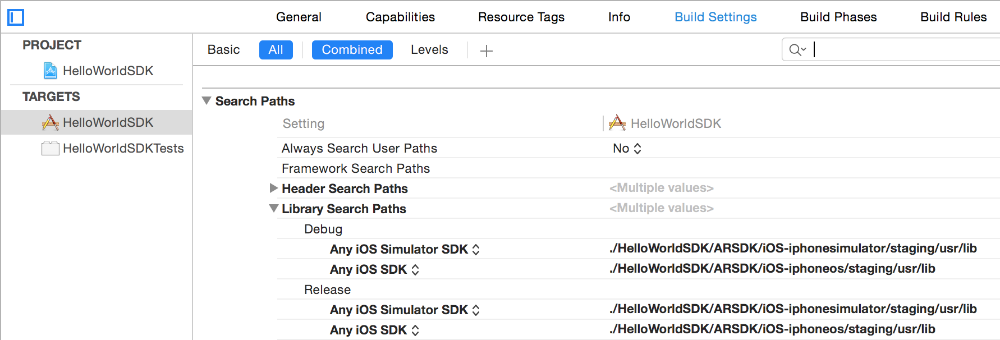
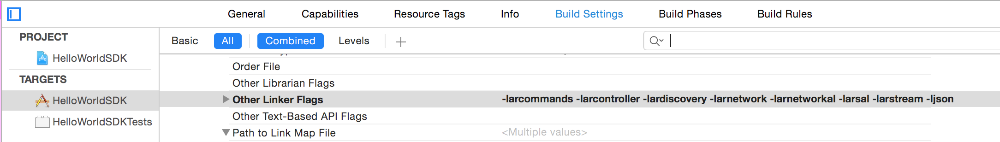
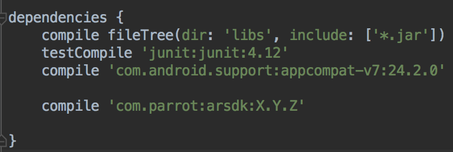

#How to use

## Creating a project

To use the sdk, you will need to add the libraries to your project. To get the libraries, you can either download the released ones, or build your own with the sources (see [how to build the SDK](#how-to-build-the-sdk)).

### iOS

1. First, download the binaries: [SDK version 3.12.4 iOS libs](https://github.com/Parrot-Developers/arsdk_manifests/releases/download/ARSDK3_version_3_12_4/ARSDK3_iOS_3_12_4.zip)
2. Unzip it.
3. In the Project Navigator in XCode, click on your project. Then click on your Target and finally click on Build Settings.
4. In *Header Search Paths*, add a *Any iOS Simulator SDK* and a *Any iOS SDK* architecture (both for Debug and Release). <br/>Then fill these architectures with:<br/><br/>
    For any simulator SDK: 
    `PATH_TO_THE_UNZIPPED_FOLDER/arsdk-ios_sim/staging/usr/include`<br/>
    For any iOS SDK: `PATH_TO_THE_UNZIPPED_FOLDER/arsdk-ios/staging/usr/include`<br/>
    

5. In *Library Search Paths*, add a *Any iOS Simulator SDK* and a *Any iOS SDK* architecture (both for Debug and Release). <br/>Then fill these architectures with:<br/><br/>
    For any simulator SDK: `PATH_TO_THE_UNZIPPED_FOLDER/arsdk-ios_sim/staging/usr/lib`<br/>
    For any iOS SDK: `PATH_TO_THE_UNZIPPED_FOLDER/arsdk-ios/staging/usr/lib`<br/>
   
6. In *Other Linker Flags* add <br/>
    `-larcommands -larcontroller -lardiscoverywithouteacc -larnetwork -larnetworkal -larsal -larstream -larstream2 -larmavlink -ljson -larmedia -larutils -lcurl -lardatatransfer -lmux -lpomp -lcrypto -lssl -lz`<br/>
    <br/><br/>
    **Please note that if you want your app to be compatible with the SkyController2, you will need to replace *-lardiscoverywithouteacc* by *-lardiscovery* and also include the framework ExternalAccessory. Using this framework will have an impact during your app submission (see [here](https://developer.apple.com/library/ios/featuredarticles/ExternalAccessoryPT/Introduction/Introduction.html#//apple_ref/doc/uid/TP40009502)).**
7. You're all set !


[Let's start coding](#start-coding) !

### Android

1. Open your app build.gradle file
2. Add to the dependencies the following line <br/>
    `compile 'com.parrot:arsdk:3.12.4'`
    
3. Load the native libraries (see code on the right)

<!-- Put code samples after the list to avoid going back to 1. -->

> Load native libraries

```c
// Not needed in C
```

```objective_c
// Not needed in Objective C
```

```java
    ARSDK.loadSDKLibs();
```

You're all set, [let's start coding](#start-coding) !
