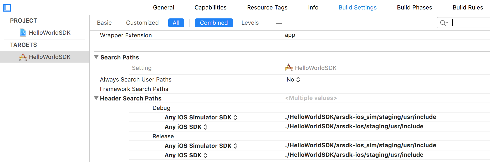

# How to use

## Creating a project

To use the sdk, you will need to add the libraries to your project. To get the libraries, you can either download the released ones, or build your own with the sources \(see [how to build the SDK](_how_to_use.md#how-to-build-the-sdk)\).

### iOS

1. First, download the binaries: [SDK version 3.13.1 iOS libs](https://github.com/Parrot-Developers/arsdk_manifests/releases/download/ARSDK3_version_3_13_1/ARSDK3_iOS_3_13_1.zip)
2. Unzip it.
3. In the Project Navigator in XCode, click on your project. Then click on your Target and finally click on Build Settings.
4. In _Header Search Paths_, add a _Any iOS Simulator SDK_ and a _Any iOS SDK_ architecture \(both for Debug and Release\).  Then fill these architectures with:   For any simulator SDK: `PATH_TO_THE_UNZIPPED_FOLDER/arsdk-ios_sim/staging/usr/include`  For any iOS SDK: `PATH_TO_THE_UNZIPPED_FOLDER/arsdk-ios/staging/usr/include` 




1. In _Library Search Paths_, add a _Any iOS Simulator SDK_ and a _Any iOS SDK_ architecture \(both for Debug and Release\).  Then fill these architectures with:   For any simulator SDK: `PATH_TO_THE_UNZIPPED_FOLDER/arsdk-ios_sim/staging/usr/lib`  For any iOS SDK: `PATH_TO_THE_UNZIPPED_FOLDER/arsdk-ios/staging/usr/lib`  
2. In _Other Linker Flags_ add   


    `-larcommands -larcontroller -lardiscoverywithouteacc -larnetwork -larnetworkal -larsal -larstream -larstream2 -larmavlink -ljson -larmedia -larutils -lcurl -lardatatransfer -lmux -lpomp -lcrypto -lssl -lz -lsdp -lrtsp -lfutils -lulog`  


      
  


    **Please note that if you want your app to be compatible with the SkyController2, you will need to replace** _**-lardiscoverywithouteacc**_ **by** _**-lardiscovery**_ **and also include the framework ExternalAccessory. Using this framework will have an impact during your app submission \(see** [**here**](https://developer.apple.com/library/ios/featuredarticles/ExternalAccessoryPT/Introduction/Introduction.html#//apple_ref/doc/uid/TP40009502)**\).**

3. You're all set !

[Let's start coding](_how_to_use.md#start-coding) !

### Android

1. Open your app build.gradle file
2. Add to the dependencies the following line   


    `compile 'com.parrot:arsdk:3.13.1'`

    

3. Load the native libraries \(see code on the right\)

> Load native libraries

```c
// Not needed in C
```

```text
// Not needed in Objective C
```

```java
    ARSDK.loadSDKLibs();
```

You're all set, [let's start coding](_how_to_use.md#start-coding) !

