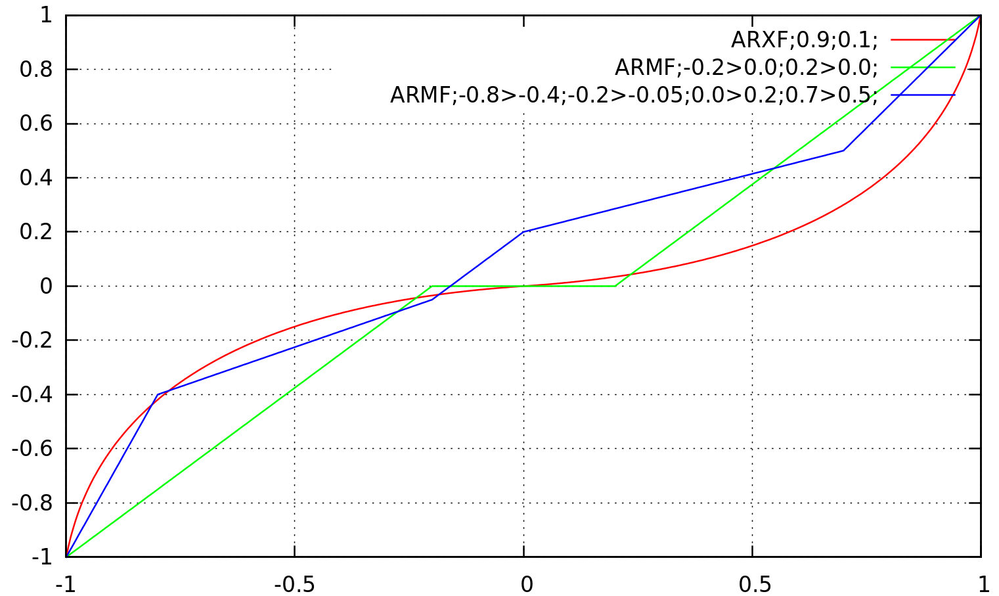

<!-- SkyController-Wifi-RequestWifiList-->
### <a name="SkyController-Wifi-RequestWifiList">Request wifi list</a><br/>
> Request wifi list:

```c
deviceController->skyController->sendWifiRequestWifiList(deviceController->skyController);
```

```objective_c
deviceController->skyController->sendWifiRequestWifiList(deviceController->skyController);
```

```java
deviceController.getFeatureSkyController().sendWifiRequestWifiList();
```

Request wifi list<br/>

The SkyController will send the list of visible wifi networks. See the [WifiList](#SkyController-WifiState-WifiList) event.

<br/>

<!-- SkyController-Wifi-RequestCurrentWifi-->
### <a name="SkyController-Wifi-RequestCurrentWifi">Request current connected wifi</a><br/>
> Request current connected wifi:

```c
deviceController->skyController->sendWifiRequestCurrentWifi(deviceController->skyController);
```

```objective_c
deviceController->skyController->sendWifiRequestCurrentWifi(deviceController->skyController);
```

```java
deviceController.getFeatureSkyController().sendWifiRequestCurrentWifi();
```

Request current connected wifi<br/>

The SkyController will send infos about its wifi connection state. See the [ConnexionChanged](#SkyController-WifiState-ConnexionChanged) event.

<br/>

<!-- SkyController-Wifi-ConnectToWifi-->
### <a name="SkyController-Wifi-ConnectToWifi">Connect to wifi</a><br/>
> Connect to wifi:

```c
deviceController->skyController->sendWifiConnectToWifi(deviceController->skyController, (char *)bssid, (char *)ssid, (char *)passphrase);
```

```objective_c
deviceController->skyController->sendWifiConnectToWifi(deviceController->skyController, (char *)bssid, (char *)ssid, (char *)passphrase);
```

```java
deviceController.getFeatureSkyController().sendWifiConnectToWifi((String)bssid, (String)ssid, (String)passphrase);
```

Connect to wifi<br/>

* bssid (string): Wifi bssid<br/>
* ssid (string): Wifi ssid<br/>
* passphrase (string): Wifi passphrase<br/>

If the network is not password-protected, then the passphrase argument is ignored.<br/>
Triggers a [ConnexionChanged](#SkyController-WifiState-ConnexionChanged) event.

<br/>

<!-- SkyController-Wifi-ForgetWifi-->
### <a name="SkyController-Wifi-ForgetWifi">Forget wifi</a><br/>
> Forget wifi:

```c
deviceController->skyController->sendWifiForgetWifi(deviceController->skyController, (char *)ssid);
```

```objective_c
deviceController->skyController->sendWifiForgetWifi(deviceController->skyController, (char *)ssid);
```

```java
deviceController.getFeatureSkyController().sendWifiForgetWifi((String)ssid);
```

Forget wifi<br/>

* ssid (string): Wifi ssid<br/>

Removes the given ssid to the autoconnect list.<br/>
If the network is the current one, a [ConnexionChanged](#SkyController-WifiState-ConnexionChanged) event will be triggered.

<br/>

<!-- SkyController-Wifi-WifiAuthChannel-->
### <a name="SkyController-Wifi-WifiAuthChannel">Get the list of authorized wifi channels</a><br/>
> Get the list of authorized wifi channels:

```c
deviceController->skyController->sendWifiWifiAuthChannel(deviceController->skyController);
```

```objective_c
deviceController->skyController->sendWifiWifiAuthChannel(deviceController->skyController);
```

```java
deviceController.getFeatureSkyController().sendWifiWifiAuthChannel();
```

Require the list of authorized wifi channels<br/>

The SkyController will send a list of [WifiAuthChannelListChanged](#SkyController-WifiState-WifiAuthChannelListChanged) events, listing all availble channels for the SkyController access point.<br/>
The list will be terminated by a [AllWifiAuthChannelChanged](#SkyController-WifiState-AllWifiAuthChannelChanged) event.<br/>
Note: The channel list might be different from the one given by the drone, due to differences in wifi-chip implementations.

<br/>

<!-- SkyController-Device-RequestDeviceList-->
### <a name="SkyController-Device-RequestDeviceList">Request Device list</a><br/>
> Request Device list (deprecated):

```c
deviceController->skyController->sendDeviceRequestDeviceList(deviceController->skyController);
```

```objective_c
deviceController->skyController->sendDeviceRequestDeviceList(deviceController->skyController);
```

```java
deviceController.getFeatureSkyController().sendDeviceRequestDeviceList();
```

Request Device list<br/>

Deprecated command, do not use.

<br/>

<!-- SkyController-Device-RequestCurrentDevice-->
### <a name="SkyController-Device-RequestCurrentDevice">Request current device</a><br/>
> Request current device (deprecated):

```c
deviceController->skyController->sendDeviceRequestCurrentDevice(deviceController->skyController);
```

```objective_c
deviceController->skyController->sendDeviceRequestCurrentDevice(deviceController->skyController);
```

```java
deviceController.getFeatureSkyController().sendDeviceRequestCurrentDevice();
```

Request current connected Device<br/>

Deprecated command, do not use.

<br/>

<!-- SkyController-Device-ConnectToDevice-->
### <a name="SkyController-Device-ConnectToDevice">Connect to a device</a><br/>
> Connect to a device (deprecated):

```c
deviceController->skyController->sendDeviceConnectToDevice(deviceController->skyController, (char *)deviceName);
```

```objective_c
deviceController->skyController->sendDeviceConnectToDevice(deviceController->skyController, (char *)deviceName);
```

```java
deviceController.getFeatureSkyController().sendDeviceConnectToDevice((String)deviceName);
```

ask to connect to a device<br/>

* deviceName (string): Device name<br/>

Deprecated command, do not use.

<br/>

<!-- SkyController-Settings-AllSettings-->
### <a name="SkyController-Settings-AllSettings">Get all product settings</a><br/>
> Get all product settings:

```c
deviceController->skyController->sendSettingsAllSettings(deviceController->skyController);
```

```objective_c
deviceController->skyController->sendSettingsAllSettings(deviceController->skyController);
```

```java
deviceController.getFeatureSkyController().sendSettingsAllSettings();
```

Get all product settings<br/>

The SkyController will trigger all settings events.<br/>
Then, it will trigger [AllSettingsChanged](#SkyController-SettingsState-AllSettingsChanged) event.<br/>

**Please note that you should not send this command if you are using the libARController API as this library is handling the connection process for you.**

<br/>

<!-- SkyController-Settings-Reset-->
### <a name="SkyController-Settings-Reset">Reset all settings</a><br/>
> Reset all settings (deprecated):

```c
deviceController->skyController->sendSettingsReset(deviceController->skyController);
```

```objective_c
deviceController->skyController->sendSettingsReset(deviceController->skyController);
```

```java
deviceController.getFeatureSkyController().sendSettingsReset();
```

Reset all settings<br/>

Deprecated command, do not use.

<br/>

<!-- SkyController-Common-AllStates-->
### <a name="SkyController-Common-AllStates">Get all product states</a><br/>
> Get all product states:

```c
deviceController->skyController->sendCommonAllStates(deviceController->skyController);
```

```objective_c
deviceController->skyController->sendCommonAllStates(deviceController->skyController);
```

```java
deviceController.getFeatureSkyController().sendCommonAllStates();
```

Get all product states<br/>

The product will trigger all its current states.
Then, it will trigger [AllStatesChanged](#SkyController-CommonState-AllStatesChanged) event.

**Please note that you should not send this command if you are using the libARController API as this library is handling the connection process for you.**

<br/>

<!-- SkyController-AccessPointSettings-AccessPointSSID-->
### <a name="SkyController-AccessPointSettings-AccessPointSSID">Set AccessPoint SSID</a><br/>
> Set AccessPoint SSID:

```c
deviceController->skyController->sendAccessPointSettingsAccessPointSSID(deviceController->skyController, (char *)ssid);
```

```objective_c
deviceController->skyController->sendAccessPointSettingsAccessPointSSID(deviceController->skyController, (char *)ssid);
```

```java
deviceController.getFeatureSkyController().sendAccessPointSettingsAccessPointSSID((String)ssid);
```

Set AccessPoint SSID<br/>

* ssid (string): AccessPoint SSID<br/>

Set the SSID for the access point. The device will send back an [AccessPointSSIDChanged](#SkyController-AccessPointSettingsState-AccessPointSSIDChanged) event, with the actually saved name.<br/>

*The new SSID will only be applied at next boot !*

<br/>

<!-- SkyController-AccessPointSettings-AccessPointChannel-->
### <a name="SkyController-AccessPointSettings-AccessPointChannel">Set AccessPoint Channel</a><br/>
> Set AccessPoint Channel:

```c
deviceController->skyController->sendAccessPointSettingsAccessPointChannel(deviceController->skyController, (uint8_t)channel);
```

```objective_c
deviceController->skyController->sendAccessPointSettingsAccessPointChannel(deviceController->skyController, (uint8_t)channel);
```

```java
deviceController.getFeatureSkyController().sendAccessPointSettingsAccessPointChannel((byte)channel);
```

Set AccessPoint Channel<br/>

* channel (u8): AccessPoint Channel<br/>

Set the current channel for the access point. The channel (if valid) is applied immediately (so you might expect a disconnection to the SkyController).<br/>
An [AccessPointChannelChanged](#SkyController-AccessPointSettingsState-AccessPointChannelChanged) event will be sent with the applied channel.

**Please use [WifiSelection](#SkyController-AccessPointSettings-WifiSelection) command to set the access point band & channel at the same time.**

<br/>

<!-- SkyController-AccessPointSettings-WifiSelection-->
### <a name="SkyController-AccessPointSettings-WifiSelection">Set AccessPoint Parameters (Band & Channel)</a><br/>
> Set AccessPoint Parameters (Band & Channel):

```c
deviceController->skyController->sendAccessPointSettingsWifiSelection(deviceController->skyController, (eARCOMMANDS_SKYCONTROLLER_ACCESSPOINTSETTINGS_WIFISELECTION_TYPE)type, (eARCOMMANDS_SKYCONTROLLER_ACCESSPOINTSETTINGS_WIFISELECTION_BAND)band, (uint8_t)channel);
```

```objective_c
deviceController->skyController->sendAccessPointSettingsWifiSelection(deviceController->skyController, (eARCOMMANDS_SKYCONTROLLER_ACCESSPOINTSETTINGS_WIFISELECTION_TYPE)type, (eARCOMMANDS_SKYCONTROLLER_ACCESSPOINTSETTINGS_WIFISELECTION_BAND)band, (uint8_t)channel);
```

```java
deviceController.getFeatureSkyController().sendAccessPointSettingsWifiSelection((ARCOMMANDS_SKYCONTROLLER_ACCESSPOINTSETTINGS_WIFISELECTION_TYPE_ENUM)type, (ARCOMMANDS_SKYCONTROLLER_ACCESSPOINTSETTINGS_WIFISELECTION_BAND_ENUM)band, (byte)channel);
```

Set AccessPoint Band and Channel<br/>

* type (enum): The type of wifi selection (only manual at the moment)<br/>
   * manual: Manual selection<br/>
* band (enum): The allowed band : 2.4 Ghz or 5 Ghz<br/>
   * 2_4ghz: 2.4 GHz band<br/>
   * 5ghz: 5 GHz band<br/>
* channel (u8): The channel<br/>

Set the access point band & channel.<br/>
Autoselection is not available on the SkyController, so the type enum must be manual.<br/>
These values (if valid) will be applied immediately (so you might expect a disconnection to the SkyController).<br/>

Triggers a [WifiSelectionChanged](#SkyController-AccessPointSettingsState-WifiSelectionChanged) event, which will contain the applied values.

<br/>

<!-- SkyController-Camera-ResetOrientation-->
### <a name="SkyController-Camera-ResetOrientation">Reset drone camera orientation</a><br/>
> Reset drone camera orientation:

```c
deviceController->skyController->sendCameraResetOrientation(deviceController->skyController);
```

```objective_c
deviceController->skyController->sendCameraResetOrientation(deviceController->skyController);
```

```java
deviceController.getFeatureSkyController().sendCameraResetOrientation();
```

Reset pan and tilt to center<br/>

This has the same effect as sending a camera command to the drone with values `0, 0`.<br/>

**As camera commands are forwarded to the drone, if you want to be able to pilot the camera from the SkyController, your app must either :**

* **Not send any camera command and use this one to reset to the center**
* **Send only camera commands when needed** (This is the approach used on FreeFlight)

<br/>

<!-- SkyController-GamepadInfos-getGamepadControls-->
### <a name="SkyController-GamepadInfos-getGamepadControls">Get button and axis list</a><br/>
> Get button and axis list:

```c
deviceController->skyController->sendGamepadInfosGetGamepadControls(deviceController->skyController);
```

```objective_c
deviceController->skyController->sendGamepadInfosGetGamepadControls(deviceController->skyController);
```

```java
deviceController.getFeatureSkyController().sendGamepadInfosGetGamepadControls();
```

Asks the SkyController to send the button and axis list<br/>

The SkyController will send a list of [gamepadControl](#SkyController-GamepadInfosState-gamepadControl) events, describing the mappable button/axis of the device.<br/>
The list is terminated by an [allGamepadControlsSent](#SkyController-GamepadInfosState-allGamepadControlsSent) event.

<br/>

<!-- SkyController-ButtonMappings-getCurrentButtonMappings-->
### <a name="SkyController-ButtonMappings-getCurrentButtonMappings">Get current button mapping</a><br/>
> Get current button mapping:

```c
deviceController->skyController->sendButtonMappingsGetCurrentButtonMappings(deviceController->skyController);
```

```objective_c
deviceController->skyController->sendButtonMappingsGetCurrentButtonMappings(deviceController->skyController);
```

```java
deviceController.getFeatureSkyController().sendButtonMappingsGetCurrentButtonMappings();
```

Asks the SkyController to send its current button mapping<br/>

The SkyController will send a list of [currentButtonMappings](#SkyController-ButtonMappingsState-currentButtonMappings) events, showing the current button->action mappings.<br/>
The list of buttons is retrieved from [gamepadControl](#SkyController-GamepadInfosState-gamepadControl) events, while the list of available actions is retrieved from [availableButtonMappings](#SkyController-ButtonMappingsState-availableButtonMappings) events.<br/>
The list is terminated by an [allCurrentButtonMappingsSent](#SkyController-ButtonMappingsState-allCurrentButtonMappingsSent) event.

<br/>

<!-- SkyController-ButtonMappings-getAvailableButtonMappings-->
### <a name="SkyController-ButtonMappings-getAvailableButtonMappings">Get available button mappings</a><br/>
> Get available button mappings:

```c
deviceController->skyController->sendButtonMappingsGetAvailableButtonMappings(deviceController->skyController);
```

```objective_c
deviceController->skyController->sendButtonMappingsGetAvailableButtonMappings(deviceController->skyController);
```

```java
deviceController.getFeatureSkyController().sendButtonMappingsGetAvailableButtonMappings();
```

Asks the SkyController to send the possible mappings for each button<br/>

The SkyController will send a list of [availableButtonMappings](#SkyController-ButtonMappingsState-availableButtonMappings) events, indicating all actions that can be mapped to a button press.<br/>
The list is terminated by an [allAvailableButtonsMappingsSent](#SkyController-ButtonMappingsState-allAvailableButtonsMappingsSent) event.

<br/>

<!-- SkyController-ButtonMappings-setButtonMapping-->
### <a name="SkyController-ButtonMappings-setButtonMapping">Set a button mapping</a><br/>
> Set a button mapping:

```c
deviceController->skyController->sendButtonMappingsSetButtonMapping(deviceController->skyController, (int32_t)key_id, (char *)mapping_uid);
```

```objective_c
deviceController->skyController->sendButtonMappingsSetButtonMapping(deviceController->skyController, (int32_t)key_id, (char *)mapping_uid);
```

```java
deviceController.getFeatureSkyController().sendButtonMappingsSetButtonMapping((int)key_id, (String)mapping_uid);
```

Set a button mapping to the SkyController<br/>

*Note: replaces previous mapping for the given key*<br/>

* key_id (i32): The keycode to map<br/>
* mapping_uid (string): The mapping to associate with the key<br/>

Set the mapping for the given button. The button key_id can be retrieved from the [gamepadControl](#SkyController-GamepadInfosState-gamepadControl) events, while the list of available actions uid is retrieved from [availableButtonMappings](#SkyController-ButtonMappingsState-availableButtonMappings) events.<br/>
After changing a mapping, the SkyController will send a list of [currentButtonMappings](#SkyController-ButtonMappingsState-currentButtonMappings) events (which can be empty if no changes were applied), followed by an [allCurrentButtonMappingsSent](#SkyController-ButtonMappingsState-allCurrentButtonMappingsSent) event.

<br/>

<!-- SkyController-ButtonMappings-defaultButtonMapping-->
### <a name="SkyController-ButtonMappings-defaultButtonMapping">Reset button mappings</a><br/>
> Reset button mappings:

```c
deviceController->skyController->sendButtonMappingsDefaultButtonMapping(deviceController->skyController);
```

```objective_c
deviceController->skyController->sendButtonMappingsDefaultButtonMapping(deviceController->skyController);
```

```java
deviceController.getFeatureSkyController().sendButtonMappingsDefaultButtonMapping();
```

Asks the SkyController to reset the button mappings to the default value<br/>

The SkyController will send a list of [currentButtonMappings](#SkyController-ButtonMappingsState-currentButtonMappings) events (if changed), followed by an [allCurrentButtonMappingsSent](#SkyController-ButtonMappingsState-allCurrentButtonMappingsSent) event. The list will contain the default mapping.<br/>

*Note: Default mapping is different for Black Edition SkyControllers*

<br/>

<!-- SkyController-AxisMappings-getCurrentAxisMappings-->
### <a name="SkyController-AxisMappings-getCurrentAxisMappings">Get current axis mapping</a><br/>
> Get current axis mapping:

```c
deviceController->skyController->sendAxisMappingsGetCurrentAxisMappings(deviceController->skyController);
```

```objective_c
deviceController->skyController->sendAxisMappingsGetCurrentAxisMappings(deviceController->skyController);
```

```java
deviceController.getFeatureSkyController().sendAxisMappingsGetCurrentAxisMappings();
```

Asks the SkyController to send its current axis mapping<br/>

The SkyController will send a list of [currentAxisMappings](#SkyController-AxisMappingsState-currentAxisMappings) events, showing the current axis->action mappings.<br/>
The list of axis is retrieved from [gamepadControl](#SkyController-GamepadInfosState-gamepadControl) events, while the list of available actions is retrieved from [availableAxisMappings](#SkyController-AxisMappingsState-availableAxisMappings) events.<br/>
The list is terminated by an [allCurrentAxisMappingsSent](#SkyController-AxisMappingsState-allCurrentAxisMappingsSent) event.

<br/>

<!-- SkyController-AxisMappings-getAvailableAxisMappings-->
### <a name="SkyController-AxisMappings-getAvailableAxisMappings">Get available axis mappings</a><br/>
> Get available axis mappings:

```c
deviceController->skyController->sendAxisMappingsGetAvailableAxisMappings(deviceController->skyController);
```

```objective_c
deviceController->skyController->sendAxisMappingsGetAvailableAxisMappings(deviceController->skyController);
```

```java
deviceController.getFeatureSkyController().sendAxisMappingsGetAvailableAxisMappings();
```

Asks the SkyController to send the possible mappings for each axis<br/>

The SkyController will send a list of [availableAxisMappings](#SkyController-AxisMappingsState-availableAxisMappings) events, indicating all actions that can be mapped to a button press.<br/>
The list is terminated by an [allAvailableAxissMappingsSent](#SkyController-AxisMappingsState-allAvailableAxissMappingsSent) event.

<br/>

<!-- SkyController-AxisMappings-setAxisMapping-->
### <a name="SkyController-AxisMappings-setAxisMapping">Set an axis mapping</a><br/>
> Set an axis mapping:

```c
deviceController->skyController->sendAxisMappingsSetAxisMapping(deviceController->skyController, (int32_t)axis_id, (char *)mapping_uid);
```

```objective_c
deviceController->skyController->sendAxisMappingsSetAxisMapping(deviceController->skyController, (int32_t)axis_id, (char *)mapping_uid);
```

```java
deviceController.getFeatureSkyController().sendAxisMappingsSetAxisMapping((int)axis_id, (String)mapping_uid);
```

Set a axis mapping to the SkyController<br/>

*Note: replaces previous mapping for the given axis*<br/>

* axis_id (i32): The axiscode to map<br/>
* mapping_uid (string): The mapping to associate with the axis<br/>

Set the mapping for the given axis. The axis_id can be retrieved from the [gamepadControl](#SkyController-GamepadInfosState-gamepadControl) events, while the list of available actions uid is retrieved from [availableAxisMappings](#SkyController-AxisMappingsState-availableAxisMappings) events.<br/>
After changing a mapping, the SkyController will send a list of [currentAxisMappings](#SkyController-AxisMappingsState-currentAxisMappings) events (which can be empty if no changes were applied), followed by an [allCurrentAxisMappingsSent](#SkyController-AxisMappingsState-allCurrentAxisMappingsSent) event.
<br/>

<!-- SkyController-AxisMappings-defaultAxisMapping-->
### <a name="SkyController-AxisMappings-defaultAxisMapping">Reset axis mappings</a><br/>
> Reset axis mappings.

```c
deviceController->skyController->sendAxisMappingsDefaultAxisMapping(deviceController->skyController);
```

```objective_c
deviceController->skyController->sendAxisMappingsDefaultAxisMapping(deviceController->skyController);
```

```java
deviceController.getFeatureSkyController().sendAxisMappingsDefaultAxisMapping();
```

Asks the SkyController to reset the axis mappings to the default value<br/>

The SkyController will send a list of [currentAxisMappings](#SkyController-AxisMappingsState-currentAxisMappings) events (if changed), followed by an [allCurrentAxisMappingsSent](#SkyController-AxisMappingsState-allCurrentAxisMappingsSent) event. The list will contain the default mapping.<br/>

<br/>

<!-- SkyController-AxisFilters-getCurrentAxisFilters-->
### <a name="SkyController-AxisFilters-getCurrentAxisFilters">Get current axis filters</a><br/>
> Get current axis filters:

```c
deviceController->skyController->sendAxisFiltersGetCurrentAxisFilters(deviceController->skyController);
```

```objective_c
deviceController->skyController->sendAxisFiltersGetCurrentAxisFilters(deviceController->skyController);
```

```java
deviceController.getFeatureSkyController().sendAxisFiltersGetCurrentAxisFilters();
```

Asks the SkyController to send its current axis filters<br/>

The SkyController will send a list of [currentAxisFilters](#SkyController-AxisFiltersState-currentAxisFilters) events, showing the current axis->filters mappings.<br/>
The list of axis is retrieved from [gamepadControl](#SkyController-GamepadInfosState-gamepadControl) events. The format of the axis filter string is explained in the [setAxisFilter](#SkyController-AxisFilters-setAxisFilter) command documentation.<br/>
The list is terminated by an [allCurrentFiltersSent](#SkyController-AxisFiltersState-allCurrentFiltersSent) event.

<br/>

<!-- SkyController-AxisFilters-getPresetAxisFilters-->
### <a name="SkyController-AxisFilters-getPresetAxisFilters">Get preset filters</a><br/>
> Get preset filters:

```c
deviceController->skyController->sendAxisFiltersGetPresetAxisFilters(deviceController->skyController);
```

```objective_c
deviceController->skyController->sendAxisFiltersGetPresetAxisFilters(deviceController->skyController);
```

```java
deviceController.getFeatureSkyController().sendAxisFiltersGetPresetAxisFilters();
```

Asks the SkyController to send the preset filters<br/>

The SkyController will send a list of [presetAxisFilters](#SkyController-AxisFiltersState-presetAxisFilters) events, indicating a list of predefined filters.<br/>
The list is terminated by an [allPresetFiltersSent](#SkyController-AxisFiltersState-allPresetFiltersSent) event.

**As of the 1.6.6 firmware, this list is empty and all filters will have to be built with the syntax given in the [setAxisFilter](#SkyController-AxisFilters-setAxisFilter) command documentation.**

<br/>

<!-- SkyController-AxisFilters-setAxisFilter-->
### <a name="SkyController-AxisFilters-setAxisFilter">Set an axis filter</a><br/>
> Set an axis filter:

```c
deviceController->skyController->sendAxisFiltersSetAxisFilter(deviceController->skyController, (int32_t)axis_id, (char *)filter_uid_or_builder);
```

```objective_c
deviceController->skyController->sendAxisFiltersSetAxisFilter(deviceController->skyController, (int32_t)axis_id, (char *)filter_uid_or_builder);
```

```java
deviceController.getFeatureSkyController().sendAxisFiltersSetAxisFilter((int)axis_id, (String)filter_uid_or_builder);
```

Set an axis filter to the SkyController<br/>

*Note: replaces previous filter for the given axis*<br/>

* axis_id (i32): The axiscode to filter<br/>
* filter_uid_or_builder (string): The mapping preset to associate with the axis (Or a string to build a new one)<br/>

Set a filter for a given axis. The axis_id can be retrieved from the [gamepadControl](#SkyController-GamepadInfosState-gamepadControl) events.<br/>
As the filters preset list is empty, all filters will have to be built from the filter builder syntax. The syntax is as follow:<br/>

* `TYPE;arg1;...;argN[;]` (the last semicolon is optionnal)

There are two types of filters available in 1.6.6 firmware:<br/>

* Multipoint filters (ARMF).
  * Those filters are the basic filters for multi-linear curves.
  * The default filter (`ARMF;`) is fully linear between the two implicit `[-1,-1]` and `[1,1]` points.
  * More points can be added if passed as arguments, with no hard limit to the number of arguments.
  * Argument format is `X>Y`, and any additional point given as argument **MUST** respect the following conditions : `x(N+1) > x(N) && y(N+1) >= y(N)`.
  * As an example, one can add a 20% deadzone to a joystick by using the following filter : `ARMF;-0.2>0;0.2>0;`.
* Exponential filters (ARXF).
  * Those filters expect exactly 2 arguments in range `[0;1]`, which are the coordinates of the control point. Those arguments are called `CPx` and `CPy`.
  * If the control point is on the diagonal (i.e. `CPx == CPy`), then the filter is linear.
  * Best results are achieved if `(CPx + CPy) == 1`, and `CPx > CPy`.

<br/>

For reference, the exponential filters code used in the 1.6.6 firmware is written in the right column.

<br/>

<pre>
// Code applied in 1.6.6 firmware for the Exponential filters
float applyExpFilter(float initial, float CPx, float CPy)
{
    float filtered;
	float absx = Math.abs(initial);
	if (CPx == CPy) {
		filtered = absx;
	} else if (CPx == 0.5f) {
		filtered = 2 * absx * (1 - absx) * CPy + (absx * absx);
	} else {
		double t = (Math.sqrt(CPx * CPx + (1 - 2 * CPx) * absx) - CPx) / (1 - 2 * CPx);
		filtered = (float) (2 * t * (1 - t) * CPy + t * t);
	}
	return (initial >= 0.f) ? filtered : -filtered;
}
</pre>

<br/>

Here are some examples of filters, with their associated builder string *(yes, the blue one is pointless, but demonstrate that multilinear filters don't have to be symmetrical, and can have a non-zero output for a zero input)*:


A simple [python script](http://developer.parrot.com/docs/skycontroller/filters.py) is also available *(linux/os-x only)* to test your filter builder strings. The script takes some builder strings as arguments *(don't forget to quote them, as it contains* `;` *and* `>` *characters that will be interpreted by your shell otherwise !)*, and will use gnuplot (must be installed on your system) to display a representation of the filter functions. The previous graph was generated using this script, with the following command: `./filters.py 'ARXF;0.9;0.1;' 'ARMF;-0.2>0;0.2>0;' 'ARMF;-0.8>-0.4;-0.2>-0.05;0>0.2;0.7>0.5;'`.

<br/>

<!-- SkyController-AxisFilters-defaultAxisFilters-->
### <a name="SkyController-AxisFilters-defaultAxisFilters">Reset axis filters</a><br/>
>  Reset axis filters:

```c
deviceController->skyController->sendAxisFiltersDefaultAxisFilters(deviceController->skyController);
```

```objective_c
deviceController->skyController->sendAxisFiltersDefaultAxisFilters(deviceController->skyController);
```

```java
deviceController.getFeatureSkyController().sendAxisFiltersDefaultAxisFilters();
```

Asks the SkyController to reset the axis filters to the default value<br/>

The SkyController will send a list of [currentAxisFilters](#SkyController-AxisFiltersState-currentAxisFilters) events (if changed), followed by an [allCurrentFiltersSent](#SkyController-AxisFiltersState-allCurrentFiltersSent) event. The list will contain the default mapping.<br/>

*As of 1.6.6 firmware, default filters are linear*

<br/>

<!-- SkyController-CoPiloting-setPilotingSource-->
### <a name="SkyController-CoPiloting-setPilotingSource">Set piloting source</a><br/>
> Set piloting source:

```c
deviceController->skyController->sendCoPilotingSetPilotingSource(deviceController->skyController, (eARCOMMANDS_SKYCONTROLLER_COPILOTING_SETPILOTINGSOURCE_SOURCE)source);
```

```objective_c
deviceController->skyController->sendCoPilotingSetPilotingSource(deviceController->skyController, (eARCOMMANDS_SKYCONTROLLER_COPILOTING_SETPILOTINGSOURCE_SOURCE)source);
```

```java
deviceController.getFeatureSkyController().sendCoPilotingSetPilotingSource((ARCOMMANDS_SKYCONTROLLER_COPILOTING_SETPILOTINGSOURCE_SOURCE_ENUM)source);
```

Set the SkyController piloting source<br/>

* source (enum): The source<br/>
   * SkyController: Use the SkyController joysticks<br/>
   * Controller: Use the Tablet (or smartphone, or whatever) controls. Disables the SkyController joysticks<br/>

The piloting source is the device which can send PCMDs (see bebop documentation for more infos).<br/>
The SkyController will send a [pilotingSource](#SkyController-CoPilotingState-pilotingSource) event when the piloting source changes.<br/>
If the controller is disconnected from the SkyController, the piloting source will automatically be reset to `SkyController`, you don't need to handle it in your application.<br/>

<br/>

<!-- SkyController-Calibration-enableMagnetoCalibrationQualityUpdates-->
### <a name="SkyController-Calibration-enableMagnetoCalibrationQualityUpdates">Request fine magnetometer calibration informations</a><br/>
> Request fine magnetometer calibration informations:

```c
deviceController->skyController->sendCalibrationEnableMagnetoCalibrationQualityUpdates(deviceController->skyController, (uint8_t)enable);
```

```objective_c
deviceController->skyController->sendCalibrationEnableMagnetoCalibrationQualityUpdates(deviceController->skyController, (uint8_t)enable);
```

```java
deviceController.getFeatureSkyController().sendCalibrationEnableMagnetoCalibrationQualityUpdates((byte)enable);
```

Asks the SkyController to send (or not) the magneto calibration quality updates.<br/>

The MagnetoCalibrationState will always be sent when the status parameters changes,<br/>

regardless of this setting.<br/>

* enable (u8): Flag to enable the feature.<br/>
   * 1 = enable quality updates<br/>
   * 0 = disable quality updates<br/>

By default, the SkyController only sends [MagnetoCalibrationState](#SkyController-CalibrationState-MagnetoCalibrationState) events when the global calibration state changes. By enabling this, these events will be sent everytime the calibration quality changes. *This can be useful in a calibration screen, but is better disabled when the information is not displayed to the user, as it can cause a lot of network traffic.*
<br/>
