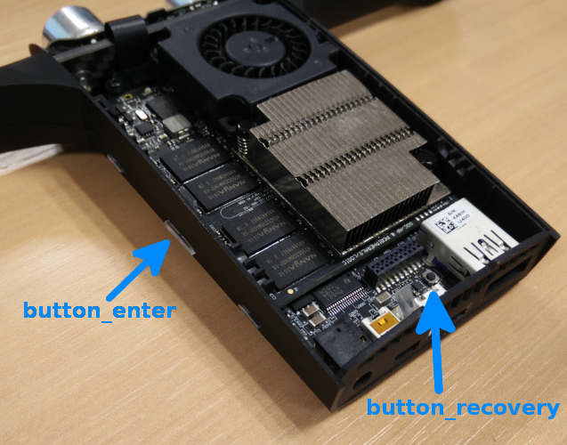

# How to use the buttons

The Parrot S.L.A.M.dunk has two buttons.



These buttons can be accessed from
the [sysfs](https://www.kernel.org/doc/Documentation/filesystems/sysfs.txt):

- `/sys/devices/platform/user-gpio/button_enter/`
- `/sys/devices/platform/user-gpio/button_recovery/`

To read the value of the button at a specific point in time,
read the `value` file.
When the button is pressed, the value is `1`,
when it is released the value is `0`, e.g:

    $ cat /sys/devices/platform/user-gpio/button_enter/value
    0

Below is a simple program,
which reads `button_enter` and execute a command when the button is pressed:

> button_enter.py

```python
#!/usr/bin/env python3

import select, subprocess, sys

if len(sys.argv) == 1:
    print("usage: {} command".format(sys.argv[0]), file=sys.stderr)
    sys.exit(1)

f = open('/sys/devices/platform/user-gpio/button_enter/value', 'r')
poller = select.epoll()
poller.register(f, select.EPOLLPRI)

while True:
    events = poller.poll()
    f.seek(0)
    if f.read().rstrip() == '1':
        subprocess.call(sys.argv[1:])
```

Make the script executable:

    chmod +x ./button_enter.py

Usage:

    $ ./button_enter.py echo "Hello world!"
    Hello world!
    Hello world!
    Hello world!
    ...

<aside class="warning">
Please note that <code class="prettyprint">button_enter</code> is specifically handled by the system,
when pressed for 3 seconds, the system will shut down.
</aside>
