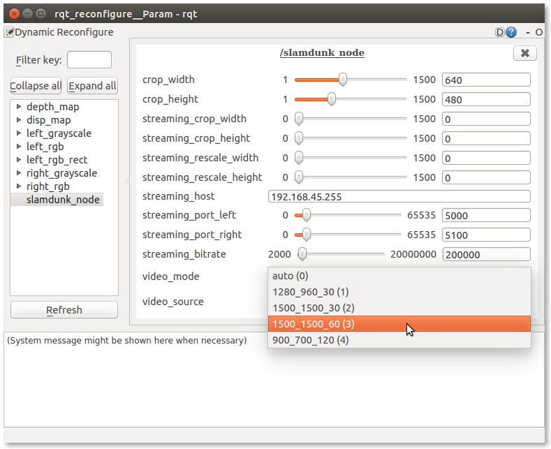

# Dynamic reconfiguration

Some of the Parrot S.L.A.M.dunk node parameters can be reconfigured dynamically.
The [dynamic_reconfigure](http://wiki.ros.org/dynamic_reconfigure) ROS tools
are used to modify these parameters.

To install them, type:

    sudo apt-get install ros-indigo-dynamic-reconfigure ros-indigo-rqt-reconfigure

## Change camera resolution and framerate

### From the command line, with dynparam

To set the camera resolution and framerate to 1500x1500 at 60 FPS from the CLI,
use `dynparam`:

    rosrun dynamic_reconfigure dynparam set /slamdunk_node video_mode 1500_1500_60

### From a GUI, with rqt_reconfigure

Launch `rqt_reconfigure`:

    rosrun rqt_reconfigure rqt_reconfigure slamdunk_node

To change the camera resolution and FPS of the Parrot S.L.A.M.dunk,
use the **video_mode** drop-down list, and select the mode of your choice.

For example, to select a camera resolution of 1500x1500, and a framerate of 60 FPS do:

<aside class="warning">
Please note that, the "900x700 120 FPS" video mode is experimental.
Some tools, such as rviz might not work reliably in this setup
(depdending on the configuration in use).
The SLAM algorithm has not been tested for this mode.
Do not use this setting if you need any output of the SLAM such as the pose,
the keyframes, etc.
</aside>
