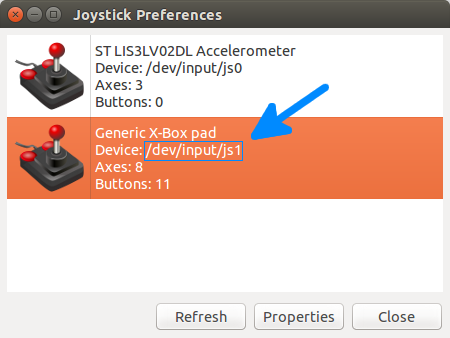

# Working with Bebop 2

The Parrot S.L.A.M.dunk and the Bebop 2 can be connected together
with the included micro USB A to micro USB B cable to extend their capabilities.

To carry and power the Parrot S.L.A.M.dunk on Bebop 2 you can refer to
[this tutorial on the Parrot developer forum](http://forum.developer.parrot.com/t/tuto-modify-your-bebop-2-to-carry-and-power-your-s-l-a-m-dunk/4725).

<aside class="notice">
Please note that the version of your Bebop 2 must be 4.1.0 or higher.
</aside>

## Use Bebop 2 Wi-Fi

It is possible to use the Bebop 2 Wifi to access Parrot S.L.A.M.dunk.
Here is an example on an Ubuntu 14.04 workstation.

Connect Parrot S.L.A.M.dunk to Bebop 2 with the micro USB A to micro USB B cable.
Start both Parrot S.L.A.M.dunk and Bebop 2 regardless of the order.
Connect to Bebop 2 Wi-Fi on your workstation.

Add a new route on your computer:

    sudo route add -net 192.168.43.0 netmask 255.255.255.0 gw 192.168.42.1

Connect to S.L.A.M.dunk:

    ssh slamdunk@192.168.43.2

## Bebop 2 Ethernet over USB

### Non persistent way

Connect the Parrot S.L.A.M.dunk to the Bebop 2 with
the micro USB A to micro USB B cable.

On the Bebop 2 press four times on the power button 
to activate Ethernet over USB.

To test the success of this operation, connect to Parrot S.L.A.M.dunk with the
method of your [choice](#network-setup);
then try to connect to the Bebop 2 with telnet:

    telnet 192.168.43.1

If you see the welcome message of the Bebop indicating: `BusyBox`,
the connection succeeded and you are connected to the Bebop 2. 
To quit, type `exit`.

### Persistent way

Press four times on the Bebop 2 power button.
From your workstation, connect to
the Bebop 2 by Wi-Fi (IP address is 192.168.42.1)
or USB with a micro USB B cable (IP is 192.168.43.1):

    telnet 192.168.<42,43>.1

If you see the welcome message of the Bebop indicating: `BusyBox`,
the connection succeeded and you are connected to the Bebop 2.

Now we will modify the startup Bebop 2 script
to launch USB over Ethernet at every start:

    dev
    sed -i 's/exit 0/\/bin\/usbnetwork.sh\n\nexit 0/' /etc/init.d/rcS

Now reboot the drone and try to connect to it through USB without pressing
the Bebop 2 button 4 times.

## Control Bebop 2

You can use the Parrot S.L.A.M.dunk to control Bebop 2.
Here are several ways to achieve it:

 - Use the built-in bebop node (see below).
 - You can make your own implementation of the
[ARSDK3](http://developer.parrot.com/docs/SDK3/)
by implementing the Linux version directly on your Parrot S.L.A.M.dunk.
 - Use a third party ROS node such as [bebop_autonomy](http://bebop-autonomy.readthedocs.io),
it implements most of the latest ARSDK3 features in a ROS node.

### Built-in bebop node

The Parrot S.L.A.M.dunk comes with a ROS node pre-installed
to control the Bebop 2.

On the Parrot S.L.AM.dunk, start the node by starting its associated service:

    start bebop_ros_node

or start directly the `bebop_node` of the `slamdunk_bebop_robot` package:

    source /opt/ros-slamdunk/setup.bash
    rosrun slamdunk_bebop_robot bebop_node

List the topics of the `bebop_node`:

    source /opt/ros-slamdunk/setup.bash
    rostopic list | grep bebop

<aside class="notice">
Please note that you have to call the topic /bebop_node/init before any
other commands. Also note the service bebop_ros_node will do it automatically.
To see what other actions the deamon is performing watch /etc/init/bebop_ros_node.conf
</aside>

## Gamepad to control Bebop 2

It's possible to use a gamepad on your computer to control
Bebop 2 with S.L.A.M.dunk.

All the gamepad or joystick working on Ubuntu can be used to control the Bebop 2
but you will have to write a simple configuration file for it. 
See the [joy ROS package](http://wiki.ros.org/joy) for more information.

Supported controllers are:

  - Logitech F310 gamepad

First [build the slamdunk_ros packages](#the-slamdunk_ros-packages)
on your workstation.

Plug the controller to your workstation.

Identify the device file for your controller with `jstest-gtk`:

    sudo apt-get update
    sudo apt-get install jstest-gtk
    jstest-gtk

Navigate through the different inputs and find the file associated
to your controller.

Report this information `/dev/input/js<X>` in the file
`slamdunk_bebop_joystick/launch/joystick.launch`
at the line `<param name="dev" value="/dev/input/js0" />`

Rebuild the node:

    catkin_make -j2

[Connect to Parrot S.L.A.M.dunk through Bebop 2 Wi-Fi](#use-bebop-2-wi-fi) and
[launch the bebop_node.](#built-in-bebop-node)

Source your environment:

    source devel/setup.bash

Export `ROS_MASTER_URI` and `ROS_HOSTNAME`:

    export ROS_MASTER_URI=http://192.168.43.2:11311
    export ROS_HOSTNAME=$(hostname).local

Use `roslaunch` to start the node:

    roslaunch slamdunk_bebop_joystick joystick.launch

For the Logitech F310 gamepad here is the mapping of the buttons and sticks:

  - Y button: take-off
  - B button: land
  - Logitech button: emergency
  - RB button + right stick: roll and pitch
  - RB button + left stick: altitude and yaw

