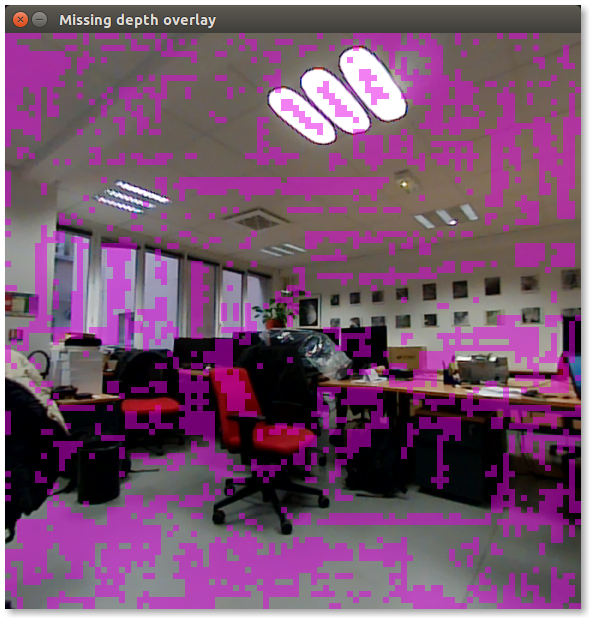

# Writing a C++ subscriber node to Parrot S.L.A.M.dunk

This tutorial explains how to make a C++ ROS node
that subscribes to the Parrot S.L.A.M.dunk topics.

This node will subscribe to two topics,
the left camera rectified color images and the depth images.
A callback function takes this pair of images and
highlights the part of the color images that do not have depth information.

This demonstrates how to subscribe to multiple inputs at once to feed an algorithm.

The node can be developed either on one's personal computer,
or on the Parrot S.L.A.M.dunk itself.
The only requirements is to have the ROS Indigo development tools installed.

<aside class="notice">
If you are not familiar with ROS,
it is a good idea to go through the ROS tutorials first:

<ul>
  <li>
    <a href="http://wiki.ros.org/ROS/Tutorials">wiki.ros.org/ROS/Tutorials</a>
  </li>
</ul>
</aside>


## Prerequisites

    sudo apt-get update
    sudo apt-get install build-essential git


## Create catkin workspace

    source /opt/ros/indigo/setup.bash
    mkdir -p ~/slamdunk_tutorial_ws/src
    cd ~/slamdunk_tutorial_ws/src
    catkin_init_workspace
    cd ..
    catkin_make

See also:

* http://wiki.ros.org/catkin/Tutorials/create_a_workspace

## Create a new ros package

    cd src
    catkin_create_pkg slamdunk_tutorial cv_bridge image_transport message_filters roscpp std_msgs
    cd ..
    catkin_make
    source devel/setup.bash

See also:

* http://wiki.ros.org/ROS/Tutorials/CreatingPackage


## Write the node

Go to the package's directory:

    cd src/slamdunk_tutorial


### CMakeLists.txt

Edit the `CMakeLists.txt`.
Uncomment and modify the `Declare a C++ executable` section to contain the following:

```cmake
# Declare a C++ executable
add_executable(missing_depth_overlay_view src/missing_depth_overlay_view.cpp)

# Add cmake target dependencies of the executable
# same as for the library above
add_dependencies(missing_depth_overlay_view ${${PROJECT_NAME}_EXPORTED_TARGETS} ${catkin_EXPORTED_TARGETS})

# Specify libraries to link a library or executable target against
target_link_libraries(missing_depth_overlay_view
  ${catkin_LIBRARIES}
)
```

### Code

Create the new file:

> `src/missing_depth_overlay_view.cpp`

```cpp
#include <cv_bridge/cv_bridge.h>
#include <image_transport/image_transport.h>
#include <image_transport/subscriber_filter.h>
#include <message_filters/time_synchronizer.h>
#include <ros/ros.h>
#include <opencv2/highgui/highgui.hpp>

namespace
{

/// Highlight missing depth pixels in the RGB image.
void maskMissingDepth(const cv::Mat &rect_color, const cv::Mat1f &depth, cv::Vec3b highlight_color,
                      double highlight_alpha, cv::Mat &out)
{
    out.create(rect_color.size(), rect_color.type());

    // depth images are smaller than color images
    const float ratio = static_cast<float>(rect_color.cols) / depth.cols;
    for (int r = 0; r < rect_color.rows; ++r)
    {
        for (int c = 0; c < rect_color.cols; ++c)
        {
            cv::Vec3b color = rect_color.at<cv::Vec3b>(r, c);

            // Blend color for bad depths (cf REP 117 & 118)
            float d = depth(r / ratio, c / ratio);
            if (!std::isfinite(d))
            {
                color = highlight_color * highlight_alpha + color * (1.0 - highlight_alpha);
            }

            out.at<cv::Vec3b>(r, c) = color;
        }
    }
}

void showMissingDepthOverlay(const sensor_msgs::ImageConstPtr &rect_color, const sensor_msgs::ImageConstPtr &depth)
{
    cv_bridge::CvImageConstPtr cv_rect_color_ptr = cv_bridge::toCvShare(rect_color);
    cv_bridge::CvImageConstPtr cv_depth_ptr = cv_bridge::toCvShare(depth);

    // pick up a distinguishable color, unlikely to appear in natural environment
    cv::Vec3b hi_color(230, 0, 230);

    cv::Mat masked;
    maskMissingDepth(cv_rect_color_ptr->image, cv_depth_ptr->image, hi_color, /*highlight_alpha=*/0.5, masked);
    cv::cvtColor(masked, masked, CV_BGR2RGB);
    cv::imshow("Missing depth overlay", masked);

    char ch = cv::waitKey(30);
    if (ch == 27 || ch == 'q')
    {
        ros::shutdown();
    }
}

}  // unnamed namespace

int main(int argc, char *argv[])
{
    // initialize the ROS node
    ros::init(argc, argv, "missing_depth_overlay_view");
    ros::NodeHandle n;

    // subscribe to the 2 image topics
    image_transport::ImageTransport it(n);
    image_transport::SubscriberFilter depth_sub(it, "/depth_map/image", 3);
    image_transport::SubscriberFilter rect_color_sub(it, "/left_rgb_rect/image_rect_color", 10);

    // synchronize the 2 topics
    message_filters::TimeSynchronizer<sensor_msgs::Image, sensor_msgs::Image> sync(rect_color_sub, depth_sub, 10);
    sync.registerCallback(boost::bind(&showMissingDepthOverlay, _1, _2));

    std::cout << "To quit, hit ^C in the console and 'q' or 'escape' in one the window.\n";

    // ROS main loop, ^C to quit
    ros::spin();
    return 0;
}
```


### The code explained


#### The `main()` function

- Initialize the node.

  ```cpp
  ros::init(argc, argv, "missing_depth_overlay_view");
  ros::NodeHandle n;
  ```

  The ROS wiki explains this in detail:
  [Writing a Simple Publisher and Subscriber (C++)](http://wiki.ros.org/ROS/Tutorials/WritingPublisherSubscriber%28c%2B%2B%29).

- Subscribe to the 2 image topics:

  ```cpp
  image_transport::ImageTransport it(n);
  image_transport::SubscriberFilter depth_sub(it, "/depth_map/image", 3);
  image_transport::SubscriberFilter rect_color_sub(it, "/left_rgb_rect/image_rect_color", 10);
  ```

  <dl>
  <dt><tt>/depth_map/image</tt></dt>
  <dd>The topic to receive the rectified depthmaps of the left camera
      (there is no depthmap for the other camera).</dd>

  <dt><tt>/left_rgb_rect/image_rect_color</tt></dt>
  <dd>The topic of the left camera,
      with the fisheye images rectified.
      <br/>
      There is a variant of this topic providing a monochrome image,
      which can be useful for computer vision algorithms.</dd>
  </dl>

  Using `image_transport` opens the possibility to stream compressed images,
  thus reducing network bandwith.
  To do so, one can specify the [TransportHints](http://docs.ros.org/indigo/api/image_transport/html/classimage__transport_1_1TransportHints.html) argument
  of the [image_transport::SubscriberFilter constructor](http://docs.ros.org/indigo/api/image_transport/html/classimage__transport_1_1SubscriberFilter.html#afae6f86755c38b573bc5fa35e43e37f3).

- Register a synchronized callback for the two topics.

  ```cpp
  message_filters::TimeSynchronizer<sensor_msgs::Image, sensor_msgs::Image> sync(rect_color_sub, depth_sub, 10);
  sync.registerCallback(boost::bind(&showMissingDepthOverlay, _1, _2));
  ```

  - The maximum rate of the depth images will usually be lower than the grayscale
    or rgb image rates.
    This means depth images will only be available for *some of* the rectified images.
  - The depth images are computed from the rectified images,
    thus they have the exact same timestamp.
    That's the reason we use an exact time synchronizer
    and not an approximate variant (http://wiki.ros.org/message_filters/ApproximateTime).

  When a pair of images, depth and rectified, with the same timestamp is received,
  the callback `showMissingDepthOverlay()` is fired.

  See also [ros.wiki.org: message_filters: Time Synchronizer](http://wiki.ros.org/message_filters#Time_Synchronizer).

- Run the main loop.

  ```cpp
  ros::spin();
  ```

  The ROS wiki explains this in detail:
  [Writing a Simple Publisher and Subscriber (C++)](http://wiki.ros.org/ROS/Tutorials/WritingPublisherSubscriber%28c%2B%2B%29#roscpp_tutorials.2BAC8-Tutorials.2BAC8-WritingPublisherSubscriber.The_Code_Explained-1).


#### The showMissingDepthOverlay() callback

This callback is the glue between the the ROS messages
and the ROS-agnostic algorithm `maskMissingDepth()`.

- Convert ROS images to OpenCV images.

  ```cpp
  cv_bridge::CvImageConstPtr cv_rect_color_ptr = cv_bridge::toCvShare(rect_color);
  cv_bridge::CvImageConstPtr cv_depth_ptr = cv_bridge::toCvShare(depth);
  ```

  See http://wiki.ros.org/cv_bridge.

- Call the OpenCV algorithm.

  ```cpp
  cv::Vec3b hi_color(230, 0, 230);
  cv::Mat masked;
  maskMissingDepth(cv_rect_color_ptr->image, cv_depth_ptr->image, hi_color, /*highlight_alpha=*/0.5, masked);
  ```

- Display the result with OpenCV.

  ```cpp
  cv::cvtColor(masked, masked, CV_BGR2RGB);
  cv::imshow("Missing depth overlay", masked);

  char ch = cv::waitKey(30);
  if (ch == 27 || ch == 'q')
  {
      ros::shutdown();
  }
  ```


#### The maskMissingDepth() algorithm

This is the ROS-agnostic algorithm.
This function adds an overlay to the rectified image.
This overlay highlights the parts of the image where depth information is not available
(e.g. due to lack of textures on a surface).

- Allocate the output image.

  ```cpp
  out.create(rect_color.size(), rect_color.type());
  ```

- Compute ratio rectified color image over depth image.

  ```cpp
  const float ratio = static_cast<float>(rect_color.cols) / depth.cols;
  ```

  Depth images do not use the same scale as the rectified color images.
  For example,
  the rectified color images can be 576x576 whereas the depth images can be 96x96
  (c.f. [Stereo settings](#stereo-settings)).

- Iterate over the input image and compute the output.

  ```cpp
  for (int r = 0; r < rect_color.rows; ++r)
  {
      for (int c = 0; c < rect_color.cols; ++c)
      {
          cv::Vec3b color = rect_color.at<cv::Vec3b>(r, c);

          // Blend color for bad depths (cf REP 117 & 118)
          float d = depth(r / ratio, c / ratio);
          if (!std::isfinite(d))
          {
              color = highlight_color * highlight_alpha + color * (1.0 - highlight_alpha);
          }

          out.at<cv::Vec3b>(r, c) = color;
      }
  }
  ```

  Depth Images are described in REP 118:

  - http://www.ros.org/reps/rep-0118.html

  REP 117, which Parrot S.L.A.M.dunk satisfies,
  states that invalid depth values are +/-Inf or quiet NaN.

  - http://www.ros.org/reps/rep-0117.html

  [std::isfinite](http://en.cppreference.com/w/cpp/numeric/math/isfinite) is
  used to verify that depth values are valid (i.e:
  [quiet_NaN()](http://en.cppreference.com/w/cpp/types/numeric_limits/quiet_NaN)).


## Build

To build the node, go in the tutorial's workspace,
install the dependencies and and invoke `catkin_make`:

    cd ~/slamdunk_tutorial_ws
    sudo rosdep init
    rosdep update
    rosdep install --from-paths src --ignore-src -y
    catkin_make


<aside class="warning">
If you have compilation issues due to with OpenCV,
this may be due to Parrot S.L.A.M.dunk using
<a href="https://docs.nvidia.com/gameworks/index.html#technologies/mobile/opencv_intro.htm">OpenCV 4 Tegra</a>.

Instructions to solve this issue is available on the Github project:

<ul>
  <li>
    <a href="https://github.com/Parrot-Developers/slamdunk_ros#opencv-compilation-issue">
        Troubleshooting: OpenCV compilation issue
    </a>
  </li>
</ul>
</aside>


## Test the node

If the node has not been written on the Parrot S.L.A.M.dunk itself,
you need to export some environment variable to tell the node
how to access the S.L.A.M.dunk node.

    export ROS_HOSTNAME=$(hostname).local
    export ROS_MASTER_URI="http://192.168.45.1:11311"

You can now run the node with `rosrun`:

    rosrun slamdunk_tutorial missing_depth_overlay_view

Sample result:




## What did we learn?

- How to create a simple node.
- How to subscribe to Parrot S.L.A.M.dunk topics.
- How to synchronize multiple topics with message filters.
- How to convert ROS messages to OpenCV and use OpenCV algorithms on them.
- How to process Parrot S.L.A.M.dunk's depth images.

## Go deeper

- Use [image_transport_plugins](http://wiki.ros.org/image_transport_plugins)
  to subscribe to compressed topics.
- Convert the node into a reusable [nodelet](http://wiki.ros.org/nodelet).
- Use and combine other Parrot S.L.A.M.dunk topics:
  pose, IMU, magnometer, keyframes' depth images, ...
