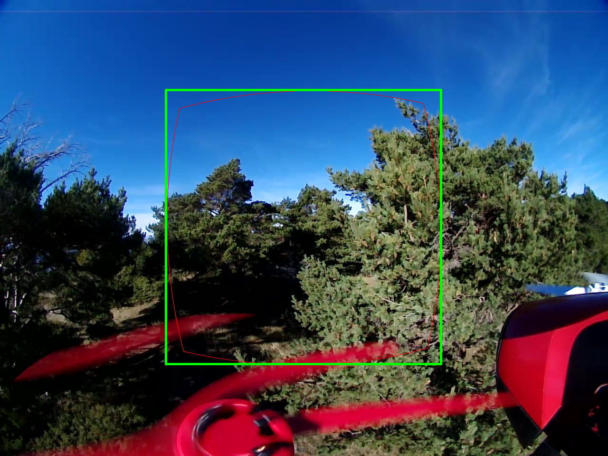
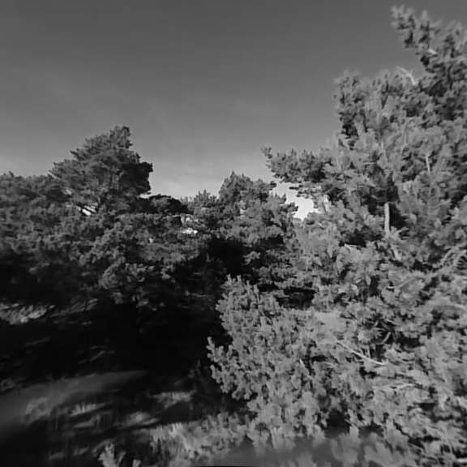
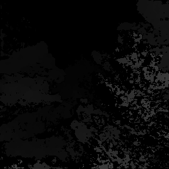

#Stereo

## Stereo calibration

`/factory/intrinsics.yml` and `/factory/extrinsics.yml` contain the camera parameters
using a format very similar to OpenCV3's fisheye model.

The main difference being in the way the optical center is stored.
OpenCV commonly measures the optical center from the top-left pixel,
we choose to measure it from the center of the image sensor.
Thus, a camera perfectly aligned with the sensor's center
would have an optical center of (0,0)

In `intrinsics.yml`:

- M1 and M2: respectively left and right camera matrices.

  - M(0, 2) and M(1, 2): optical center, expressed in pixel units from the image center
  - M(0, 0) and M(1, 1): focal lengths fx, fy.

  

  $$
  M = \begin{bmatrix}
      f_x & 0    & c_x \\\\\\
      0   & f_y  & c_y \\\\\\
      0   & 0    & 1
      \end{bmatrix}
  $$
  

- D1 and D2: left and right camera distortion parameters.

    reminder: apart from the optical center,
    these parameters are compatible with the **fisheye** model of OpenCV3.

In `extrinsic.yml`:

- R1 and R2: rectification transform (rotation matrix) for the left and right cameras respectively.
- T: translation vector between the coordinate systems of the cameras.
- R: rotation matrix between the left and right camera coordinate systems.

## Stereo settings

You can tweek the stereo matching settings in the `/etc/kalamos/stereo.yml` file.
You'll find a description of most parameters within the stereo.yml file,
but it would be easier to understand what the 3 configurable resolutions refer to with illustrations.

The image below is an rgb image from the left camera.
The green rectangle, of size cropCols/cropRows (here 576/576), delimits the ROI for depth calculation.
The red lines delimit the pixels that will be rectified. Please note how the red area is inscribed in the green rectangle.

The image below is the left rectified image and is of size rectCols/rectRows (here 576/576).
Please note that rectSize and cropSize do NOT have to be the same, but it usually makes sense for them to be.

Finally, the image below is the resulting depth image and is of size depthCols/depthRows (here 288/288).
Please note that rectSize has to be a multiple of depthSize (here, x2).

