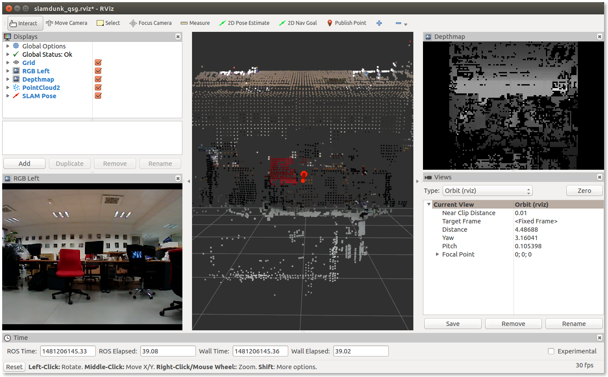
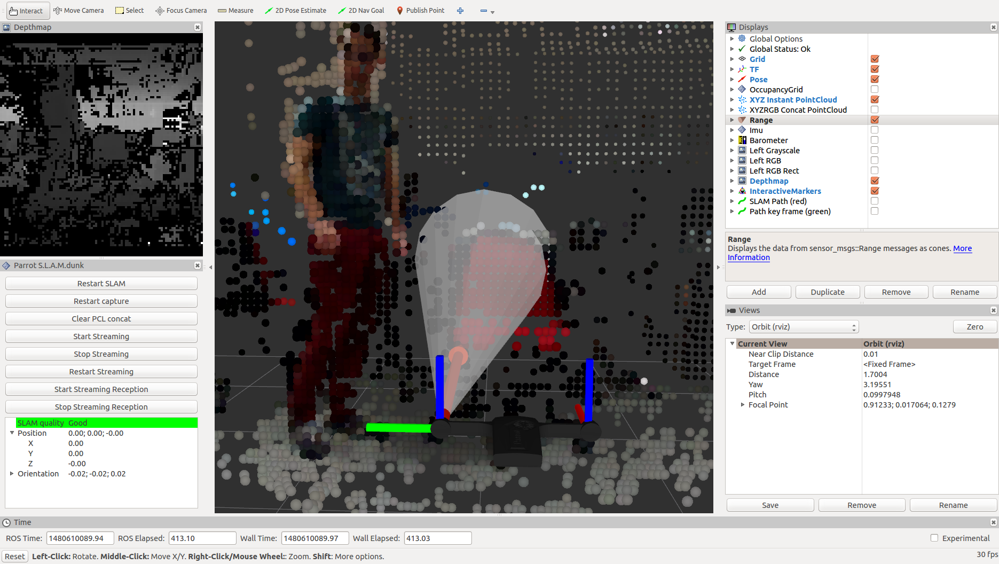

# Visualization with rviz

The Parrot S.L.A.M.dunk publish many topics.
The topics vary greatly from IMU to 3D point clouds,
passing by depthmap and SLAM pose.

[rviz](http://wiki.ros.org/rviz) is a very useful tool to visualize all these data.

The Parrot S.L.A.M.dunk comes with a preset display configuration for rviz.
The configuration shows a few topics and does not require additional rviz plugins.

To retrieve the configuration and run it, type (default password is `slamdunk`):

    scp slamdunk@192.168.45.1:slamdunk_qsg.rviz .
    rviz -d slamdunk_qsg.rviz

## The slamdunk_visualization package

In the [slamdunk_ros Github repository](https://github.com/Parrot-Developers/slamdunk_ros),
a more advanced rviz configuration is available.
This configuration is part of the `slamdunk_visualization` package.

To test the advanced rviz configuration,
first follow the build steps described in [the slamdunk_ros packages](#the-slamdunk_ros-packages) section.

Then, if you are not on the Parrot S.L.A.M.dunk itself,
configure the environment (cf. [Network setup](#network-setup)):

    export ROS_MASTER_URI="http://192.168.45.1:11311"
    export ROS_HOSTNAME=$(hostname).local

Finally, launch rviz:

    rviz -d $(rospack find slamdunk_visualization)/rviz/slamdunk.rviz

