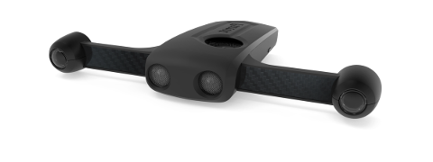

# Overview

Welcome to the Parrot S.L.A.M.dunk documentation!

This site describes how to develop for the Parrot S.L.A.M.dunk.

For developement questions,
where Parrot S.L.A.M.dunk software engineers and users can answer,
use the developer forum:

- http://forum.developer.parrot.com/c/s-l-a-m-dunk

For other inquiries, such as hardware related issues,
please favor the support website:

- https://www.parrot.com/support
